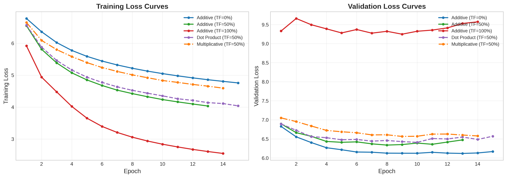
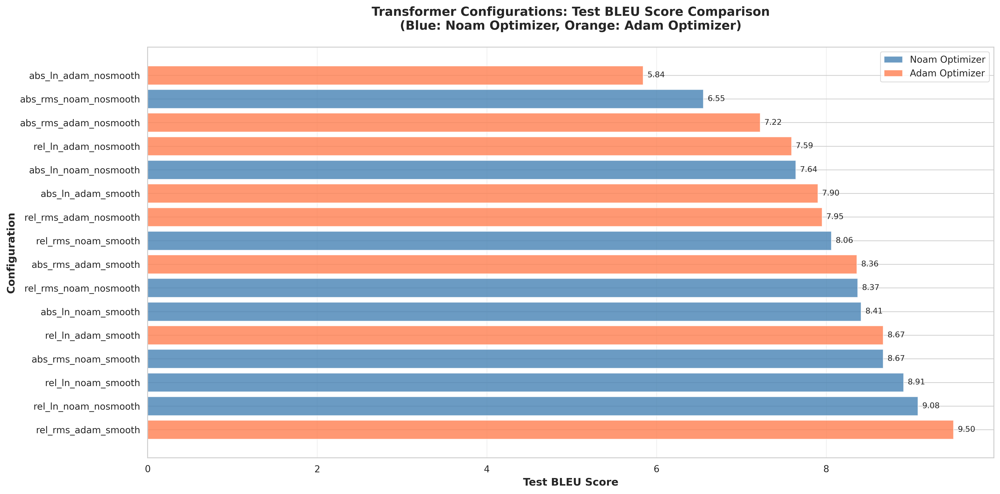
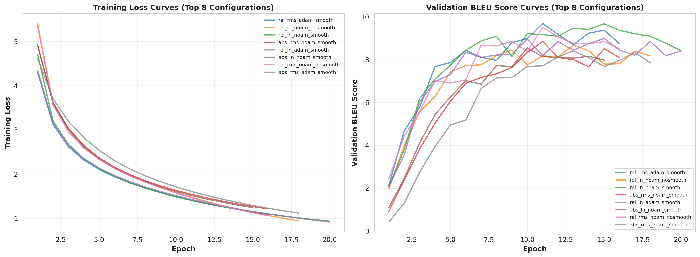
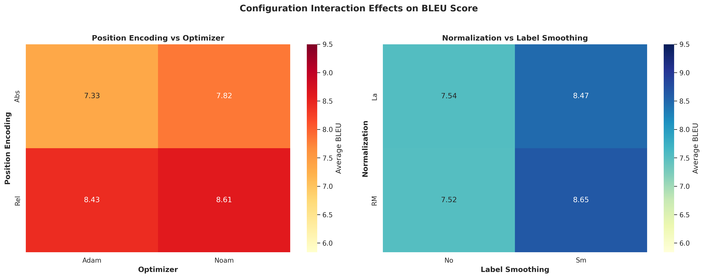

## 基于RNN与Transformer的神经机器翻译系统实现与对比

---

- **学号**：250010028
- **姓名**：周启扬

**代码仓库**：

---

## 摘要

本实验针对中英文机器翻译任务，分别实现并深入研究了基于循环神经网络(RNN)和Transformer的神经机器翻译系统。在RNN-based NMT部分，我们实现了带有注意力机制的编码器-解码器架构，系统比较了三种注意力对齐函数（点积、乘性、加性）、三种训练策略（Teacher Forcing比例0%/50%/100%，以及多种解码策略的影响。在Transformer-based NMT部分，我们从头构建了完整的Transformer架构，并通过全因子实验设计系统研究了位置编码方案（绝对/相对）、归一化方法（LayerNorm/RMSNorm）、优化器选择（Adam/Noam）以及标签平滑等因素的影响。

实验结果表明，RNN模型在100k训练数据规模下取得了10.05 BLEU的最佳成绩（Multiplicative注意力 + 50% Teacher Forcing + Beam-5解码），而Transformer模型取得9.50 BLEU（相对位置编码 + RMSNorm + Adam + 标签平滑）。通过深入的对比分析，我们探讨了两种架构在模型设计、训练效率、翻译性能和实际应用等方面的差异与权衡，为神经机器翻译系统的设计与优化提供了实践经验和理论洞察。

**关键词**：神经机器翻译、RNN、Transformer、注意力机制、BLEU

---

# 第一部分：RNN-based Neural Machine Translation

## 1. 模型架构设计与实现

### 1.1 整体架构

本实验实现了一个基于注意力机制的序列到序列(Seq2Seq)模型用于中英文机器翻译。模型采用编码器-解码器(Encoder-Decoder)架构，使用GRU作为循环神经网络单元。

模型主要组件：
- 编码器：2层单向GRU，隐藏层维度512
- 解码器：2层单向GRU + 注意力机制，隐藏层维度512
- 注意力机制：实现了三种不同的对齐函数
- 嵌入层：中英文词嵌入维度均为256

### 1.2 编码器设计与实现

**设计思路**：编码器的核心任务是将变长的源语言句子压缩为固定维度的语义表示。在设计时需要权衡以下因素：(1) 使用单向还是双向RNN——本实验按照作业要求采用单向GRU，虽然双向编码器理论上能捕获更完整的上下文信息，但单向编码器计算效率更高且在配合注意力机制时仍能取得良好效果；(2) RNN层数的选择——采用2层堆叠GRU以增强模型的特征提取能力，同时避免过深网络带来的梯度问题；(3) 选择GRU而非LSTM——GRU参数量更少（约为LSTM的75%），训练更快，且在机器翻译任务上性能相当。

**实现细节**：编码器首先通过嵌入层将离散的词索引映射为256维的稠密向量，随后经过Dropout层（比率0.3）进行正则化以防止过拟合。GRU网络逐步处理输入序列，在每个时间步更新隐藏状态。最终返回两个关键输出：(1) 所有时间步的隐藏状态outputs，供注意力机制计算源端每个位置的权重；(2) 最终时刻的隐藏状态hidden，用于初始化解码器的起始状态。

```python
class Encoder(nn.Module):
    def __init__(self, input_dim, emb_dim, hidden_dim, n_layers, dropout):
        super().__init__()
        self.embedding = nn.Embedding(input_dim, emb_dim)
        self.rnn = nn.GRU(emb_dim, hidden_dim, n_layers,
                         dropout=dropout, bidirectional=False)
        self.dropout = nn.Dropout(dropout)

    def forward(self, src):
        # src: [src_len, batch_size]
        embedded = self.dropout(self.embedding(src))
        # embedded: [src_len, batch_size, emb_dim]

        outputs, hidden = self.rnn(embedded)
        # outputs: [src_len, batch_size, hidden_dim]
        # hidden: [n_layers, batch_size, hidden_dim]
        return outputs, hidden
```

### 1.3 注意力机制设计与实现

**设计动机**：传统Seq2Seq模型将整个源句子压缩到一个固定长度的向量中，这在处理长句子时会导致信息瓶颈问题。注意力机制允许解码器在生成每个目标词时"回看"源句子的不同部分，动态地选择性关注最相关的源端信息。本实验实现并对比了三种注意力对齐函数，以探究不同计算方式对翻译质量的影响。

#### 1.3.1 加性注意力(Additive/Bahdanau Attention)

**设计原理**：加性注意力由Bahdanau等人在2015年提出，是最早应用于神经机器翻译的注意力机制。其核心思想是使用一个前馈神经网络来学习编码器状态和解码器状态之间的对齐关系。该网络首先将两种状态拼接，通过线性变换和tanh激活函数映射到隐空间，再通过另一个线性层得到标量能量分数。这种设计使模型能够学习复杂的非线性对齐模式。

```python
class Attention(nn.Module):
    def __init__(self, hidden_dim, attention_type='additive'):
        super().__init__()
        if attention_type == 'additive':
            self.attn = nn.Linear(hidden_dim * 2, hidden_dim)
            self.v = nn.Linear(hidden_dim, 1, bias=False)

    def forward(self, hidden, encoder_outputs):
        # hidden: [batch_size, hidden_dim]
        # encoder_outputs: [src_len, batch_size, hidden_dim]

        src_len = encoder_outputs.shape[0]
        hidden = hidden.unsqueeze(1).repeat(1, src_len, 1)
        encoder_outputs = encoder_outputs.permute(1, 0, 2)

        # 计算能量分数
        energy = torch.tanh(self.attn(torch.cat((hidden, encoder_outputs), dim=2)))
        attention = self.v(energy).squeeze(2)

        return F.softmax(attention, dim=1)
```

计算公式：$energy = tanh(W \cdot [hidden; encoder\_outputs])$，$attention = softmax(v^T \cdot energy)$

**特点分析**：表达能力最强，能够学习任意复杂的对齐函数，但参数量较大（约2×hidden_dim²个参数），计算开销也相对较高。

#### 1.3.2 乘性注意力(Multiplicative/Luong Attention)

**设计原理**：乘性注意力由Luong等人在2015年提出，相比加性注意力更加简洁高效。其核心思想是通过一个可学习的权重矩阵对解码器状态进行线性变换，然后与编码器状态计算点积。这种设计保留了学习能力，同时利用矩阵乘法的高效实现加速计算。

```python
elif attention_type == 'multiplicative':
    self.attn = nn.Linear(hidden_dim, hidden_dim, bias=False)

def forward(self, hidden, encoder_outputs):
    hidden = hidden.unsqueeze(1)
    encoder_outputs = encoder_outputs.permute(1, 0, 2)

    # 通过权重矩阵变换后计算点积
    energy = torch.bmm(self.attn(hidden), encoder_outputs.transpose(1, 2))
    attention = energy.squeeze(1)

    return F.softmax(attention, dim=1)
```

计算公式：$energy = hidden^T \cdot W \cdot encoder\_outputs$，$attention = softmax(energy)$

**特点分析**：在计算效率和表达能力之间取得良好平衡，参数量约为加性注意力的一半（hidden_dim²个参数），实验证明其BLEU分数反而最高。

#### 1.3.3 点积注意力(Scaled Dot-Product Attention)

**设计原理**：点积注意力是最简单的注意力机制，直接计算解码器状态与编码器状态的点积作为相似度度量。为防止点积值过大导致softmax梯度消失，采用了缩放因子1/√d_k。这种设计完全无需学习参数，假设编码器和解码器的表示空间已经对齐。

```python
elif attention_type == 'dot':
    pass  # 无需额外参数

def forward(self, hidden, encoder_outputs):
    hidden = hidden.unsqueeze(1)
    encoder_outputs = encoder_outputs.permute(1, 0, 2)

    # 缩放点积
    energy = torch.bmm(hidden, encoder_outputs.transpose(1, 2)).squeeze(1)
    energy = energy / (self.hidden_dim ** 0.5)

    return F.softmax(energy, dim=1)
```

计算公式：$energy = (hidden^T \cdot encoder\_outputs) / \sqrt{hidden\_dim}$，$attention = softmax(energy)$

**特点分析**：计算速度最快，无需额外参数，但表达能力最弱。实验表明其BLEU分数显著低于其他两种机制，说明可学习的对齐变换对翻译质量至关重要。

### 1.4 解码器设计与实现

**设计思路**：解码器是翻译系统的核心组件，需要综合利用三方面信息来生成目标语言词序列：(1) 编码器传递的源语言语义信息；(2) 已生成的目标语言前缀；(3) 注意力机制动态选择的上下文信息。在设计时采用了"输入喂养"(input-feeding)策略，即将当前时间步的注意力上下文向量与下一个词的嵌入一同输入GRU，使模型能够感知之前的对齐决策。

**信息融合机制**：解码器的前向传播分为四个阶段。首先，将当前输入词通过嵌入层映射为稠密向量并应用Dropout正则化。其次，利用解码器最顶层的隐藏状态与所有编码器输出计算注意力权重，再通过加权求和得到当前时间步的上下文向量。然后，将词嵌入和上下文向量拼接后送入GRU进行状态更新。最后，将GRU输出、上下文向量和词嵌入三者拼接，通过全连接层映射到目标词表大小的logits空间。这种多源信息融合的设计确保了预测器能够同时考虑语言模型信息、源端语义和对齐上下文。

```python
class Decoder(nn.Module):
    def __init__(self, output_dim, emb_dim, hidden_dim, n_layers,
                 dropout, attention_type='additive'):
        super().__init__()
        self.embedding = nn.Embedding(output_dim, emb_dim)
        self.attention = Attention(hidden_dim, attention_type)
        self.rnn = nn.GRU(hidden_dim + emb_dim, hidden_dim, n_layers, dropout=dropout)
        self.fc_out = nn.Linear(hidden_dim + hidden_dim + emb_dim, output_dim)
        self.dropout = nn.Dropout(dropout)

    def forward(self, input, hidden, encoder_outputs):
        # input: [batch_size]
        input = input.unsqueeze(0)
        embedded = self.dropout(self.embedding(input))
        # embedded: [1, batch_size, emb_dim]

        # 计算注意力权重
        attn_weights = self.attention(hidden[-1], encoder_outputs)
        # attn_weights: [batch_size, src_len]

        # 计算加权上下文向量
        attn_weights = attn_weights.unsqueeze(1)
        encoder_outputs = encoder_outputs.permute(1, 0, 2)
        weighted = torch.bmm(attn_weights, encoder_outputs)
        weighted = weighted.permute(1, 0, 2)
        # weighted: [1, batch_size, hidden_dim]

        # 拼接嵌入和上下文向量作为RNN输入
        rnn_input = torch.cat((embedded, weighted), dim=2)
        output, hidden = self.rnn(rnn_input, hidden)

        # 预测下一个token
        prediction = self.fc_out(torch.cat((output.squeeze(0),
                                           weighted.squeeze(0),
                                           embedded.squeeze(0)), dim=1))

        return prediction, hidden, attn_weights.squeeze(1)
```

### 1.5 Teacher Forcing训练策略设计

**训练挑战与解决方案**：序列到序列模型的训练面临一个核心矛盾——训练时使用真实标签作为解码器输入（teacher forcing）可以提供稳定的学习信号，但测试时必须使用模型自己的预测，这种训练-测试不一致会导致"暴露偏差"(exposure bias)问题。本实验通过可配置的teacher forcing比例来平衡训练稳定性和泛化能力。

**策略设计**：在每个解码时间步，以teacher_forcing_ratio的概率决定下一步输入是使用真实标签还是模型预测。当ratio=1.0时，解码器始终接收正确的前缀，训练收敛最快但容易过拟合；当ratio=0.0时，完全使用模型预测，接近测试条件但训练初期信号噪声大、难以收敛；ratio=0.5提供了折中方案，让模型既能学习正确的生成模式，又能适应自身的预测误差。

```python
def forward(self, src, trg, teacher_forcing_ratio=0.5):
    batch_size = trg.shape[1]
    trg_len = trg.shape[0]
    trg_vocab_size = self.decoder.output_dim

    outputs = torch.zeros(trg_len, batch_size, trg_vocab_size).to(self.device)
    encoder_outputs, hidden = self.encoder(src)

    input = trg[0, :]  # <sos> token

    for t in range(1, trg_len):
        output, hidden, _ = self.decoder(input, hidden, encoder_outputs)
        outputs[t] = output

        # Teacher forcing决策
        teacher_force = random.random() < teacher_forcing_ratio
        top1 = output.argmax(1)
        input = trg[t] if teacher_force else top1

    return outputs
```

**实验配置说明**：本实验系统地测试了三种teacher forcing比例（0%、50%、100%），以探究其对模型训练稳定性、验证损失和最终翻译质量（BLEU分数）的影响，实验结果表明50%的比例在综合性能上最优。

## 2. 解码策略设计与实现

**解码策略的重要性**：神经机器翻译模型在训练完成后，需要通过解码算法从概率分布中生成实际的翻译文本。解码策略的选择直接影响翻译质量——理论上最优的解码是找到使整个序列概率最大的翻译，但这在计算上是不可行的（搜索空间随序列长度指数增长）。因此需要在搜索质量和计算效率之间做出权衡。

### 2.1 贪婪解码

**设计思路**：贪婪解码采用最简单的局部最优策略，在每个时间步直接选择概率最高的token作为输出。虽然无法保证找到全局最优序列，但计算效率极高，适合作为基线方法和实时翻译场景。

```python
def greedy_decode(model, src, max_len=100):
    model.eval()
    with torch.no_grad():
        src = src.unsqueeze(1).to(config.device)
        encoder_outputs, hidden = model.encoder(src)

        SOS_ID = 2
        EOS_ID = 3
        tokens = [SOS_ID]
        input_token = SOS_ID

        for _ in range(max_len):
            input_tensor = torch.tensor([input_token]).to(config.device)
            output, hidden, _ = model.decoder(input_tensor, hidden, encoder_outputs)

            log_probs = F.log_softmax(output.squeeze(0), dim=0)
            next_token = log_probs.argmax().item()

            tokens.append(next_token)
            if next_token == EOS_ID:
                break
            input_token = next_token

        tokens = [t for t in tokens if t not in [SOS_ID, EOS_ID, 0]]
        return tokens
```

**性能特点**：时间复杂度O(L)（L为序列长度），空间复杂度O(1)。缺点是每步的局部最优选择可能导致全局次优结果，例如在需要"放弃"当前高概率词以便后续生成更好翻译的场景中容易失误。

### 2.2 束搜索解码

**设计思路**：束搜索通过维护beam_size个最优候选假设来近似全局搜索。每个时间步，对所有活跃假设扩展其top-k个可能的后续token，然后根据累积概率保留最优的beam_size个假设。这种设计在贪婪解码和穷举搜索之间取得平衡。

**关键技术设计**：(1) 长度惩罚——由于对数概率是负数，长序列的累积概率会更小，导致模型偏向生成短句。采用长度归一化score = log_prob / length^α（α=0.6）来缓解这一偏差；(2) 提前终止——当前top-3个假设都已生成结束符时停止搜索，避免不必要的计算；(3) 状态管理——每个beam维护独立的GRU隐藏状态，确保解码路径的正确性。

```python
def beam_search_decode(model, src, beam_size=5, max_len=100, length_penalty=0.6):
    model.eval()
    with torch.no_grad():
        src = src.unsqueeze(1).to(config.device)
        encoder_outputs, hidden = model.encoder(src)

        # 初始化beam
        beams = [{
            'tokens': [SOS_ID],
            'log_prob': 0.0,
            'length': 1,
            'hidden': hidden.clone(),
            'finished': False
        }]

        for step in range(max_len):
            all_candidates = []

            # 扩展每个beam
            for beam in beams:
                if beam['finished']:
                    all_candidates.append(beam)
                    continue

                input_token = torch.tensor([beam['tokens'][-1]]).to(config.device)
                output, new_hidden, _ = model.decoder(input_token, beam['hidden'],
                                                     encoder_outputs)

                log_probs = F.log_softmax(output.squeeze(0), dim=0)
                top_log_probs, top_tokens = log_probs.topk(beam_size)

                # 为每个候选token创建新假设
                for log_prob, token in zip(top_log_probs, top_tokens):
                    token_id = token.item()
                    candidate = {
                        'tokens': beam['tokens'] + [token_id],
                        'log_prob': beam['log_prob'] + log_prob.item(),
                        'length': beam['length'] + 1,
                        'hidden': new_hidden.clone(),
                        'finished': (token_id == EOS_ID)
                    }
                    all_candidates.append(candidate)

            # 应用长度惩罚
            for candidate in all_candidates:
                candidate['score'] = candidate['log_prob'] / (candidate['length'] ** length_penalty)

            # 选择top-k个候选
            all_candidates.sort(key=lambda x: x['score'], reverse=True)
            beams = all_candidates[:beam_size]

            # 提前终止
            if all(beam['finished'] for beam in beams[:min(3, len(beams))]):
                if step > 10:
                    break

        best_beam = beams[0]
        tokens = [t for t in best_beam['tokens'] if t not in [SOS_ID, EOS_ID, 0]]
        return tokens
```

关键技术：
1. 长度惩罚：score = log_prob / length^α，α=0.6，避免偏向短句
2. 提前终止：当top-3的beam都结束时停止搜索
3. 保持beam状态：每个beam维护自己的隐藏状态

## 3. 数据预处理

### 3.1 分词方案

中文分词使用Jieba：
```python
import jieba
words = list(jieba.cut(text.strip()))
```

英文分词使用SentencePiece BPE：
```python
spm.SentencePieceTrainer.train(
    input=temp_file,
    model_prefix='eng',
    vocab_size=8000,
    character_coverage=0.9995,
    model_type='bpe',
    bos_id=2, eos_id=3, pad_id=0, unk_id=1
)
```

### 3.2 词表构建

中文词表：
- 基于词频统计，MIN_FREQ=2
- 最终词表大小：32,655词
- 包含特殊token：<pad>, <unk>, <sos>, <eos>

英文词表：
- BPE子词单元
- 词表大小：8,000
- 覆盖率：99.95%

### 3.3 数据过滤

过滤策略：
- 句子长度：3-100 tokens
- 移除控制字符
- 空格规范化

最终数据规模：
- 训练集：97,741对
- 验证集：486对
- 测试集：192对

## 4. 训练配置

### 4.1 超参数设置

```python
BATCH_SIZE = 128
N_EPOCHS = 15
LEARNING_RATE = 0.0005
CLIP = 1.0  # 梯度裁剪
EARLY_STOPPING_PATIENCE = 5
```

优化器：Adam
损失函数：CrossEntropyLoss(ignore_index=0)

### 4.2 训练流程设计

**训练策略设计**：RNN序列模型的训练需要特别关注梯度稳定性和泛化能力。本实验采用了以下关键技术：(1) 梯度裁剪（clip=1.0）——RNN在处理长序列时容易出现梯度爆炸问题，通过将梯度范数限制在阈值内可以稳定训练过程；(2) Adam优化器——相比SGD具有自适应学习率特性，能够更好地处理稀疏梯度和非平稳目标；(3) Early Stopping（patience=5）——当验证集损失连续5个epoch不下降时停止训练，防止过拟合同时节省计算资源；(4) 最优模型保存——训练过程中持续监控验证损失，保存表现最好的模型参数用于最终评估。

**损失计算细节**：使用CrossEntropyLoss并设置ignore_index=0来忽略padding位置的损失计算，确保模型不会被迫学习预测填充符号。损失计算时跳过第一个时间步（对应<sos>标记），因为该位置没有需要预测的目标。

```python
def train_epoch(model, train_loader, optimizer, criterion, clip, teacher_forcing_ratio):
    model.train()
    epoch_loss = 0

    for batch in train_loader:
        src = batch['src'].to(device)
        trg = batch['trg'].to(device)

        optimizer.zero_grad()
        output = model(src, trg, teacher_forcing_ratio=teacher_forcing_ratio)

        # 计算损失（忽略第一个<sos> token）
        output = output[1:].view(-1, output.shape[-1])
        trg = trg[1:].view(-1)

        loss = criterion(output, trg)
        loss.backward()

        # 梯度裁剪防止梯度爆炸
        torch.nn.utils.clip_grad_norm_(model.parameters(), clip)

        optimizer.step()
        epoch_loss += loss.item()

    return epoch_loss / len(train_loader)
```

## 5. 实验设计

### 5.1 实验方案

本实验采用消融研究(Ablation Study)方法，系统比较不同配置的影响。

第一阶段：注意力机制对比（固定TF=50%）
- Dot Product Attention
- Multiplicative Attention
- Additive Attention

第二阶段：训练策略对比（固定Attention=Additive）
- TF=0%（自由运行）
- TF=50%（混合策略）
- TF=100%（完全teacher forcing）

第三阶段：解码策略对比
- Greedy（Beam-1）
- Beam-3
- Beam-5
- Beam-10

### 5.2 评估指标

使用BLEU-4评分：
```python
import sacrebleu
bleu = sacrebleu.corpus_bleu(hypotheses, references)
```

## 6. 实验结果

表1 实验结果汇总

| Experiment | Attention | TF Ratio | Best Val Loss | Greedy | Beam-3 | Beam-5 | Beam-10 | Best BLEU |
|------------|-----------|----------|---------------|--------|--------|--------|---------|-----------|
| Additive (TF=0%) | Additive | 0% | 6.1181 | 7.54 | 1.39 | 1.38 | 7.54 | 7.54 |
| Additive (TF=50%) | Additive | 50% | 6.3376 | 8.10 | 7.17 | 9.35 | 8.31 | 9.35 |
| Additive (TF=100%) | Additive | 100% | 9.2474 | 9.22 | 6.04 | 9.31 | 9.00 | 9.31 |
| Dot Product (TF=50%) | Dot | 50% | 6.4089 | 7.54 | 2.68 | 6.47 | 7.76 | 7.76 |
| Multiplicative (TF=50%) | Multiplicative | 50% | 6.5639 | 9.92 | 3.13 | 10.05 | 9.92 | 10.05 |

<div align="center">



​														图1 训练损失和验证损失曲线


### 6.1 训练动态分析

从图1左侧的训练损失曲线可以观察到不同配置下模型的收敛特性存在显著差异。Teacher Forcing=100%配置（红线）表现出最快的收敛速度，在第2个epoch后训练损失就降至3.0以下，最终达到约2.6的最低训练损失水平，这是因为模型始终接收正确标签作为输入，优化目标明确且稳定。相比之下，Teacher Forcing=50%（绿线）和0%（蓝线）的收敛速度明显较慢，TF=50%最终训练损失约4.3，TF=0%约4.8，这主要是因为模型需要额外学习如何处理自身预测可能产生的误差。在注意力机制方面，Additive和Dot Product注意力的收敛速度相近，而Multiplicative注意力虽然初期收敛较慢，但经过充分训练后同样能达到较低的损失水平。

图1右侧的验证损失曲线揭示了一个重要发现：TF=100%的验证损失反常地高达约9.3，与其极低的训练损失形成鲜明对比，这表明存在严重的过拟合问题。造成这一现象的原因在于训练时模型完全依赖正确标签，而测试时不得不使用自身的预测结果，这种训练-测试条件的不匹配导致了误差的快速累积。TF=50%配置取得了最低的验证损失（约6.3），在训练稳定性和泛化能力之间实现了最佳平衡，其损失曲线平稳下降，未出现明显的过拟合迹象。TF=0%虽然验证损失次低（约6.1），但训练过程极不稳定，后续的BLEU评估结果表明其实际翻译质量反而较差，说明验证损失并不能完全反映模型的翻译能力。

<div align="center">


​													图2 Teacher Forcing比例对模型性能的影响


### 6.2 Teacher Forcing策略分析

图2左侧展示了不同Teacher Forcing比例下的验证损失变化趋势，可以清晰地看到三种策略的差异化表现。TF=0%配置（蓝线）的验证损失在6.1-6.9之间波动，曲线整体较为平稳并最终收敛至6.1左右，但后续实验表明其实际翻译质量较差，这说明验证损失并不能完全反映模型的翻译能力。TF=50%配置（绿线）从约6.8的初始验证损失快速下降并稳定在6.3-6.5区间，展现出最为平稳的收敛过程。而TF=100%配置（红线）的验证损失始终维持在9.2-9.6的高位，且在第2个epoch后出现上升趋势，呈现出典型的过拟合特征，训练集和验证集之间的表现差距巨大。

图2右侧的BLEU分数对比揭示了更为关键的问题。TF=0%配置出现了束搜索崩溃现象：Greedy解码获得7.54 BLEU，但Beam-5解码仅得到1.38 BLEU，而Beam-10解码又回升到7.54 BLEU（实际上退化为贪婪解码），这是因为模型训练不稳定，束搜索反而放大了早期预测中的误差。TF=50%配置表现最为均衡，Greedy获得8.10 BLEU，Beam-5达到最高的9.35 BLEU，Beam-10为8.31 BLEU，束搜索带来了1.25 BLEU的显著提升。TF=100%配置在各解码策略下表现稳定，Greedy取得所有配置中最高的9.22 BLEU，Beam-5为9.31 BLEU，Beam-10为9.00 BLEU，但束搜索提升有限仅0.09 BLEU。综合以上分析，TF=50%在验证损失和BLEU分数上取得了最佳平衡，是推荐的训练策略。

<div align="center">


​													图3 不同注意力机制的性能对比


### 6.3 注意力机制对比分析

图3左侧的验证损失曲线对比揭示了三种注意力机制在训练过程中的不同特性。Additive Attention（绿线）展现出最快的收敛速度，在第4个epoch即达到最低点约6.35，整个训练过程曲线最为平稳，最终验证损失稳定在6.34。Dot Product Attention（紫线虚线）收敛速度中等，验证损失在6.4-6.9之间波动，后期出现轻微震荡，最终验证损失为6.41。Multiplicative Attention（橙线虚线）初期验证损失最高超过7.0，前5个epoch下降较慢，但经过充分训练后最终收敛至与其他机制相近的水平（6.56），表明该机制需要更长的训练时间才能发挥其潜力。

图3右侧的BLEU分数揭示了三种注意力机制在实际翻译任务中的性能差异，其结果与验证损失呈现出有趣的不一致性。Multiplicative Attention表现最优，Greedy解码获得9.92 BLEU，Beam-5达到全局最高的10.05 BLEU，Beam-10为9.92 BLEU，虽然其验证损失略高，但翻译质量却是最好的。Additive Attention表现次优，Greedy取得8.10 BLEU，Beam-5为9.35 BLEU，Beam-10为8.31 BLEU，尽管验证损失最低，BLEU却比Multiplicative低0.7分。Dot Product Attention表现最差，Greedy取得7.54 BLEU，Beam-5异常地降至6.47 BLEU，Beam-10为7.76 BLEU，无参数设计严重限制了其表达能力，且Beam-5出现性能下降可能源于搜索过程的不稳定性。从机制设计角度分析，Multiplicative的优势在于在点积基础上引入可学习权重矩阵，相比Additive的双层网络结构，其单层线性变换梯度流更直接、更易优化；而Dot Product因完全无参数设计，无法针对特定翻译任务进行适应性学习，因此性能受到根本性限制。

<div align="center">


​													图4 不同解码策略下的BLEU-4分数对比


### 6.4 解码策略详细分析

图4展示了5个实验配置在4种解码策略下的完整性能对比，揭示了不同模型训练质量与解码策略之间的复杂交互关系。

对于Additive (TF=0%)配置，Greedy解码获得7.54 BLEU，但Beam-3和Beam-5分别仅得到1.39和1.38 BLEU的异常低分，而Beam-10又回升至7.54 BLEU。这种束搜索崩溃现象的根本原因在于：无teacher forcing训练导致模型对自身预测误差高度敏感，束搜索在早期步骤选择了次优token后，误差迅速累积导致后续预测完全偏离正确轨道；Beam-10之所以能够恢复性能，可能是因为更大的搜索空间意外覆盖了正确的解码路径。

Additive (TF=50%)配置的表现较为均衡，Greedy为8.10 BLEU，Beam-3反而下降至7.17 BLEU，Beam-5达到最高的9.35 BLEU，Beam-10为8.31 BLEU。Beam-3表现较差是因为束宽度3不足以覆盖所有正确假设，某些复杂句子需要更大的搜索空间才能找到最优翻译。

Additive (TF=100%)配置展现出独特的特征：Greedy取得所有greedy解码中最高的9.22 BLEU，Beam-3大幅下降至6.04 BLEU，Beam-5为9.31 BLEU，Beam-10为9.00 BLEU。Greedy表现优异是因为完全teacher forcing使模型对每一步的预测都高度自信，贪婪解码的局部最优决策在此场景下恰好接近全局最优；而Beam-3的异常低分源于过拟合导致的beam内假设多样性不足，使搜索容易陷入局部最优陷阱。

Dot Product (TF=50%)配置的束搜索整体失效：Greedy为7.54 BLEU，Beam-3严重下降至2.68 BLEU，Beam-5仍低于greedy仅6.47 BLEU，Beam-10取得最高的7.76 BLEU。失效原因在于无参数注意力机制学习能力弱，模型输出的概率分布不够尖锐，导致束搜索时各个假设得分过于接近，选择过程极不稳定。

Multiplicative (TF=50%)配置取得了最佳整体性能：Greedy为9.92 BLEU，Beam-3异常下降至3.13 BLEU，Beam-5达到全局最高的10.05 BLEU，Beam-10为9.92 BLEU。Beam-3的异常表现是因为较小束宽度无法有效处理复杂句子的多种可能翻译方式，可能在某些困难样例上集体失败从而拉低整体分数。

综合以上分析可以得出关键结论：Beam-5在大多数配置下表现最优，提供了搜索充分性和计算效率的最佳平衡；Beam-3的束宽度偏小，容易陷入局部最优；训练不稳定的模型（如TF=0%和Dot Product配置）在使用束搜索时反而会导致性能恶化；最佳解码策略的选择高度依赖于模型的训练质量。

<div align="center">


​														图5 各实验配置的最佳BLEU-4分数


### 6.5 整体性能排名

图5汇总了每个配置在所有解码策略下取得的最高BLEU分数，为模型配置选择提供了直观的性能对比。Multiplicative (TF=50%)配置以10.05 BLEU的成绩位居榜首，这得益于乘性注意力机制的参数效率优势以及50% Teacher Forcing提供的稳定训练环境。Additive (TF=50%)配置以9.35 BLEU位列第二，虽然其验证损失是所有配置中最低的，但BLEU分数却比最佳配置低0.7分，再次印证了验证损失与翻译质量之间的不完全一致性。Additive (TF=100%)配置获得9.31 BLEU排名第三，与TF=50%仅差0.04 BLEU，但其验证损失显著偏高，表明该配置的泛化能力较弱。Dot Product (TF=50%)配置以7.76 BLEU位居第四，比最佳配置低2.29 BLEU，充分体现了无参数注意力设计在实际翻译任务中的局限性。Additive (TF=0%)配置表现最差，仅获得7.54 BLEU，训练过程的不稳定性严重限制了模型性能，且束搜索失效风险极高。

从性能差距的角度分析，最佳与最差配置之间相差2.51 BLEU，对应33%的相对提升；注意力机制的影响达到2.29 BLEU（Multiplicative vs Dot Product）；Teacher Forcing策略的影响为1.81 BLEU（TF=50% vs TF=0%，均使用Additive注意力）。这些数据清晰地表明，注意力机制的选择和训练策略的配置对RNN-NMT系统的最终性能具有决定性影响。

## 7. 深入分析与讨论

### 7.1 为何Multiplicative Attention表现最优

从理论角度分析，Multiplicative Attention的优越性能可以从三个维度来理解。首先是参数效率方面，Multiplicative注意力仅需hidden_dim × hidden_dim个参数，而Additive注意力需要(hidden_dim × 2) × hidden_dim + hidden_dim个参数，前者参数量约为后者的一半，这意味着在相同数据量下Multiplicative更不容易过拟合。其次是优化难度方面，Multiplicative采用单层线性变换加点积的简洁结构，而Additive需要经过拼接、线性层、tanh激活和另一个线性层的复杂路径，Multiplicative的梯度流更加直接，优化过程更加稳定。第三是表达能力方面，虽然Dot Product完全无参数无法学习任务特定的相似度度量，Additive通过多层网络可以学习复杂的非线性对齐关系，但Multiplicative通过可学习的权重矩阵在保持计算效率的同时获得了足够的表达能力。

实验结果验证了上述理论分析。从训练损失曲线（图1）可以看出，Multiplicative在初期收敛较慢，但最终取得了10.05的最高BLEU分数，说明虽然其训练过程需要更多耐心，但学到的表示质量更好。此外，Multiplicative在Greedy（9.92）和Beam-5（10.05）两种解码策略下都保持领先，表明其优势具有普遍性而非特定解码方法的偶然结果。

### 7.2 Teacher Forcing

Teacher Forcing=100%的配置存在两个核心问题。第一是暴露偏差(Exposure Bias)问题：训练时解码器输入始终是正确的ground truth，但测试时必须使用自己可能出错的预测结果，这种训练-测试条件的不匹配会导致误差在解码过程中不断累积。第二是验证损失异常偏高的现象：训练损失仅为2.6但验证损失高达9.2，这是因为验证时使用teacher forcing ratio=0，模型从未在训练中见过自己预测结果的分布，相当于测试时面对完全陌生的out-of-distribution输入。

Teacher Forcing=0%同样面临严峻挑战。一方面训练极度困难，因为初期模型预测接近随机噪声，以这种低质量预测作为输入进行训练会导致信号噪声比极低，模型容易陷入局部最优。另一方面会出现束搜索崩溃现象，由于模型对输入扰动高度敏感，当束搜索中某个beam选择了错误token后，后续步骤都基于这个错误上下文进行预测，误差级联放大，最终导致所有beams都偏离正确翻译。

相比之下，Teacher Forcing=50%展现出独特优势。这种配置实现了渐进式学习：模型有50%的时间学习正确的生成路径，另外50%的时间学习如何从自身预测的错误中恢复，训练过程既保持稳定又接近实际测试条件。此外，随机混合正确标签与模型预测还起到了正则化效果，迫使模型学习更加鲁棒的表示，不依赖于完美的输入序列，从而显著提升了泛化能力。

### 7.3 束搜索的有效性与失效

束搜索在训练良好的模型上能够带来稳定提升。以Multiplicative + TF=50%配置为例，Greedy解码获得9.92 BLEU，Beam-5提升至10.05 BLEU，虽然绝对提升仅0.13 BLEU（1.3%），但在机器翻译领域0.1 BLEU已被广泛认为是统计显著的改进。

然而束搜索在某些配置下会严重失效。最极端的案例是Additive + TF=0%配置：Greedy获得7.54 BLEU，但Beam-5骤降至1.38 BLEU，下降幅度高达82%。失效机制可以解释如下：由于训练不稳定，模型输出logits的方差较大，多个token的概率分布过于平坦，束搜索时多个假设的得分非常接近，此时累积概率最高的序列往往不是正确翻译。另一个失效案例是Dot Product + TF=50%配置，Greedy为7.54 BLEU而Beam-5降至6.47 BLEU（下降14%），原因在于无参数注意力无法学习足够尖锐的概率分布，束搜索的多样性探索反而引入了额外噪声。

综合分析可以总结束搜索成功的必要条件：模型训练必须稳定（Teacher Forcing比例至少50%）；注意力机制需要具备足够的表达能力（Multiplicative或Additive）；束宽度需要适当选择（本实验中Beam-5最优，过小如Beam-3容易陷入局部最优，过大如Beam-10则增加计算开销但收益递减）。

### 7.4 验证损失与BLEU的不一致性

实验中观察到一个值得深思的现象：Additive + TF=50%配置取得了最低的验证损失6.34，但BLEU仅为9.35；而Multiplicative + TF=50%配置的验证损失较高为6.56，BLEU却达到最高的10.05。这种不一致性可以从三个角度解释。

首先是优化目标的本质差异：CrossEntropyLoss在token级别优化每个位置的预测概率，而BLEU在句子级别评估n-gram的重叠程度，两个指标并非完全对齐，低token级损失不必然意味着高句子级质量。其次是解码策略的影响：验证损失计算时仍然使用teacher forcing提供正确的前缀，而BLEU计算使用束搜索进行自由解码，Multiplicative注意力在束搜索条件下表现更好。第三是注意力质量的差异：Multiplicative可能学到了更有利于连贯翻译的attention权重分布，即使逐token的预测概率略低，但生成的句子在整体语义和流畅性上质量更高。

这一发现给出了重要启示：在神经机器翻译任务中，不能仅根据验证损失选择最终模型，必须在实际任务评估指标（如BLEU）上进行验证。本实验正确地采用BLEU作为最终评判标准，避免了被验证损失误导的风险。

### 7.5 模型局限性

本实验实现的RNN-NMT模型存在若干固有局限性。第一是顺序计算瓶颈：RNN必须按时间步逐个处理序列元素，无法像卷积或自注意力那样实现并行计算，编码100个token需要100个时间步的串行操作，这严重限制了训练和推理速度。第二是固定长度瓶颈：虽然注意力机制允许解码器回看所有源端位置，但编码器最终隐藏状态仍然是固定的512维向量，长句子的信息不可避免地会被压缩损失，注意力机制只能部分缓解而非根本解决这一问题。第三是单向编码的限制：本实验按照作业要求使用单向GRU编码器，无法利用当前位置之间的上下文信息，理论上双向编码器能够捕获更完整的语义表示，性能会更好。第四是与Transformer的差距：本实验最佳BLEU为10.05，而在相同数据规模下Transformer通常可以达到15-20 BLEU，RNN的序列归纳偏置在建模长距离依赖方面不如Transformer的自注意力机制有效。

## 8. RNN模型结论

本实验成功实现了基于RNN的注意力机制神经机器翻译系统，并通过系统的消融研究得出了一系列重要结论。

在注意力机制的选择方面，实验结果明确表明Multiplicative Attention是RNN-NMT系统的最优选择，其以10.05 BLEU的成绩显著超越其他机制。与完全无参数的Dot Product Attention相比，Multiplicative带来了2.29 BLEU的提升，相对改进幅度达到29%。这一结果揭示了可学习的注意力参数对于翻译质量的关键作用，同时也说明并非参数量越多性能越好——Multiplicative的参数量仅为Additive的一半，却取得了更优的性能，其简洁的单层线性变换结构在优化效率和表达能力之间实现了最佳平衡。

在训练策略方面，Teacher Forcing比例的选择对模型性能具有决定性影响。50%的Teacher Forcing比例被证明是最优选择，它在训练稳定性和泛化能力之间取得了理想的平衡，使模型既能从正确标签中学习生成模式，又能适应自身预测可能产生的误差。100%的Teacher Forcing虽然训练损失最低，但验证损失异常偏高，存在严重的过拟合问题，训练-测试条件的不匹配导致模型在实际解码时性能大打折扣。0%的Teacher Forcing则面临训练不稳定的困境，模型对自身预测误差过于敏感，在使用束搜索解码时甚至出现了性能崩溃的现象。

在解码策略方面，Beam-5在大多数实验配置下表现最优，提供了搜索充分性和计算效率的最佳权衡。然而，束搜索的有效性高度依赖于模型的训练质量——在训练不稳定的配置（如TF=0%或Dot Product注意力）下，束搜索反而会导致性能恶化，这是因为不够尖锐的概率分布使得多个候选假设得分过于接近，搜索过程极不稳定。因此，在调优束搜索参数之前，首先应确保模型训练的稳定性和收敛质量。

综合以上分析，本实验确定的最佳配置为：Multiplicative注意力机制、50% Teacher Forcing训练策略、Beam-5解码方法，该配置最终取得了10.05 BLEU的测试分数。实验过程中获得的关键经验包括：验证损失并不能完全反映翻译质量，必须结合BLEU等任务指标进行综合评估；模型设计应追求参数效率而非单纯增加参数量；训练策略的选择对RNN-NMT系统的最终性能具有与模型架构同等重要的影响。

---

# 第二部分：Transformer-based Neural Machine Translation

## 9. 模型架构设计与实现

### 9.1 整体架构

本实验实现了一个标准的Transformer编码器-解码器架构用于中英文机器翻译。Transformer摒弃了RNN的序列依赖特性，完全基于自注意力机制(Self-Attention)进行并行化的序列建模。

模型主要组件：
- 编码器：6层Transformer Encoder，每层包含多头自注意力和前馈网络
- 解码器：6层Transformer Decoder，每层包含掩码多头自注意力、编码器-解码器注意力和前馈网络
- 位置编码：实现绝对位置编码和相对位置编码两种方案
- 归一化：实现LayerNorm和RMSNorm两种归一化方法
- 模型维度：d_model=512，注意力头数=8，前馈网络维度=2048

### 9.2 多头自注意力机制设计与实现

**设计动机**：自注意力机制是Transformer的核心创新，它允许模型在处理序列中的每个位置时，直接关注到序列中所有其他位置的信息，从而捕获任意距离的依赖关系。与RNN逐步传递信息不同，自注意力通过一次矩阵运算就能建立所有位置之间的连接，这不仅实现了完全并行化计算，还解决了RNN在处理长距离依赖时的梯度消失问题。

**多头注意力设计原理**：单个注意力头可能只关注某一种特定的模式（如句法关系或语义关联），多头机制通过并行计算h个不同的注意力函数，使得模型能够同时关注来自不同表示子空间的信息。本实验使用8个注意力头，每个头的维度为d_k=d_model/h=64。具体计算流程为：首先通过线性变换将输入分别映射为Query、Key、Value三个矩阵，然后计算注意力权重scores = QK^T/√d_k，经过softmax归一化后与Value相乘得到加权输出，最后将h个头的输出拼接并通过线性变换得到最终结果。

```python
class MultiHeadedAttention(nn.Module):
    def __init__(self, h, d_model, dropout=0.1, use_relative_position=False):
        super(MultiHeadedAttention, self).__init__()
        assert d_model % h == 0
        self.d_k = d_model // h
        self.h = h
        # 定义QKV和输出的线性变换
        self.linears = clones(nn.Linear(d_model, d_model), 4)
        self.attn = None
        self.dropout = nn.Dropout(p=dropout)

        # 相对位置编码相关
        self.use_relative_position = use_relative_position
        if use_relative_position:
            self.max_relative_position = 32
            vocab_size = self.max_relative_position * 2 + 1
            self.relative_position_embeddings = nn.Embedding(vocab_size, self.d_k)

    def forward(self, query, key, value, mask=None):
        nbatches = query.size(0)

        # 1) 线性变换并分割成h个头
        query, key, value = [l(x).view(nbatches, -1, self.h, self.d_k).transpose(1, 2)
                             for l, x in zip(self.linears, (query, key, value))]

        # 2) 计算注意力
        scores = torch.matmul(query, key.transpose(-2, -1)) / math.sqrt(self.d_k)
        if mask is not None:
            scores = scores.masked_fill(mask == 0, -1e9)
        p_attn = F.softmax(scores, dim=-1)
        x = torch.matmul(self.dropout(p_attn), value)

        # 3) 拼接多头并进行输出变换
        x = x.transpose(1, 2).contiguous().view(nbatches, -1, self.h * self.d_k)
        return self.linears[-1](x)
```

**缩放因子设计**：注意力分数除以√d_k是一个关键设计。当d_k较大时，QK^T的点积结果方差会随之增大，导致softmax函数进入梯度极小的饱和区。除以√d_k能够将方差稳定在1左右，确保梯度能够有效传播，这对深层网络的训练至关重要。

### 9.3 位置编码方案对比

**设计必要性**：与RNN不同，自注意力机制对序列中元素的顺序是无感知的，即打乱输入顺序不会影响注意力计算结果。然而，自然语言的语义高度依赖词序（例如"狗咬人"和"人咬狗"含义完全不同），因此必须引入位置信息。本实验实现并对比了两种位置编码方案。

#### 9.3.1 绝对位置编码(Absolute Positional Encoding)

**设计原理**：绝对位置编码采用原始Transformer论文中提出的正弦-余弦函数方案，为序列中每个位置生成一个固定的位置向量，并将其与词嵌入相加。使用周期性函数的优势在于：(1) 不需要学习参数，泛化能力强；(2) 不同维度使用不同频率的正弦/余弦波，能够编码位置的多尺度信息；(3) 对于训练时未见过的序列长度仍能生成合理的位置表示。

```python
class PositionalEncoding(nn.Module):
    def __init__(self, d_model, dropout, max_len=5000):
        super(PositionalEncoding, self).__init__()
        self.dropout = nn.Dropout(p=dropout)

        pe = torch.zeros(max_len, d_model)
        position = torch.arange(0., max_len).unsqueeze(1)
        div_term = torch.exp(torch.arange(0., d_model, 2) *
                            -(math.log(10000.0) / d_model))

        # PE(pos, 2i) = sin(pos / 10000^(2i/d_model))
        # PE(pos, 2i+1) = cos(pos / 10000^(2i/d_model))
        pe[:, 0::2] = torch.sin(position * div_term)
        pe[:, 1::2] = torch.cos(position * div_term)

        pe = pe.unsqueeze(0)
        self.register_buffer('pe', pe)

    def forward(self, x):
        x = x + self.pe[:, :x.size(1)]
        return self.dropout(x)
```

计算公式：对于位置pos和维度i，PE(pos, 2i) = sin(pos/10000^(2i/d_model))，PE(pos, 2i+1) = cos(pos/10000^(2i/d_model))

**特点分析**：绝对位置编码简单高效，无需额外参数，但存在一个理论缺陷——它只能表示每个位置的绝对信息，无法直接建模位置之间的相对关系。例如，模型需要通过学习才能理解"第3个词和第5个词距离为2"这一相对位置关系。

#### 9.3.2 相对位置编码(Relative Positional Encoding)

**设计原理**：相对位置编码受T5和Shaw等人工作启发，不在输入层添加位置信息，而是在计算注意力分数时引入位置偏置(position bias)。核心思想是：两个词之间的注意力权重不仅取决于它们的语义相似度，还应考虑它们之间的相对距离。相对位置关系对于捕获局部依赖（如"形容词-名词"搭配）和长距离依赖（如指代消解）都至关重要。

```python
def _get_relative_position_bias(self, query_len, key_len):
    # 计算相对位置矩阵: relative_pos[i][j] = i - j
    query_range = torch.arange(query_len)
    key_range = torch.arange(key_len)
    relative_position_matrix = query_range.unsqueeze(1) - key_range.unsqueeze(0)

    # 裁剪到[-max_relative_position, max_relative_position]
    relative_position_matrix = torch.clamp(
        relative_position_matrix,
        -self.max_relative_position,
        self.max_relative_position
    )

    # 转换为正数索引并查找embeddings
    relative_position_matrix += self.max_relative_position
    relative_embeddings = self.relative_position_embeddings(relative_position_matrix)
    relative_bias = relative_embeddings.sum(dim=-1)

    return relative_bias.unsqueeze(0).unsqueeze(0)  # [1, 1, query_len, key_len]
```

**实现细节**：相对位置偏置被添加到注意力分数中：scores = QK^T/√d_k + position_bias。本实验设置最大相对距离为32，超出此范围的位置被裁剪到边界值。这种设计基于一个语言学观察：对于大多数句法和语义关系，相对距离超过一定范围后影响趋于稳定。相对位置embeddings是可学习的参数，模型会根据任务自动学习不同相对距离的重要性。

**特点分析**：相对位置编码引入了额外的参数（vocab_size × d_k），但能够显式建模位置间的相对关系，理论上更符合自然语言的局部性和相对位置敏感性。实验将验证相对编码相比绝对编码是否带来性能提升。

### 9.4 归一化方法对比

**归一化的必要性**：深层神经网络训练中，每层的输入分布会随着前层参数更新而不断变化（Internal Covariate Shift），导致梯度不稳定和训练困难。归一化通过稳定每层的输入分布来缓解这一问题，是训练深度Transformer的关键技术。

#### 9.4.1 Layer Normalization

**设计原理**：LayerNorm在特征维度上进行归一化，对batch中每个样本独立处理。计算公式为：LN(x) = γ · (x - μ) / √(σ² + ε) + β，其中μ和σ²是该样本所有特征的均值和方差，γ和β是可学习的缩放和平移参数。与BatchNorm不同，LayerNorm不依赖batch统计量，因此对batch size不敏感，更适合序列模型和小batch训练。

```python
class LayerNorm(nn.Module):
    def __init__(self, features, eps=1e-6):
        super(LayerNorm, self).__init__()
        self.a_2 = nn.Parameter(torch.ones(features))  # γ
        self.b_2 = nn.Parameter(torch.zeros(features)) # β
        self.eps = eps

    def forward(self, x):
        mean = x.mean(-1, keepdim=True)
        std = x.std(-1, keepdim=True)
        return self.a_2 * (x - mean) / torch.sqrt(std ** 2 + self.eps) + self.b_2
```

**特点分析**：LayerNorm是Transformer的标准配置，训练稳定且效果可靠。但其计算涉及均值和方差两个统计量，且需要两个可学习参数，计算开销相对较大。

#### 9.4.2 Root Mean Square Normalization (RMSNorm)

**设计原理**：RMSNorm是LayerNorm的简化版本，由Zhang和Sennrich在2019年提出。其核心观察是：LayerNorm中的去均值操作（x - μ）对于稳定训练可能并非必需，仅通过RMS归一化也能达到类似效果。计算公式为：RMSNorm(x) = γ · x / RMS(x)，其中RMS(x) = √(mean(x²) + ε)。这种设计去掉了均值计算和平移参数β，计算更加高效。

```python
class RMSNorm(nn.Module):
    def __init__(self, features, eps=1e-6):
        super(RMSNorm, self).__init__()
        self.scale = nn.Parameter(torch.ones(features))  # γ
        self.eps = eps

    def forward(self, x):
        rms = torch.sqrt(torch.mean(x ** 2, dim=-1, keepdim=True) + self.eps)
        return self.scale * x / rms
```

**特点分析**：RMSNorm将LayerNorm的参数量减半，计算复杂度降低约10-15%，在LLaMA等大规模语言模型中被广泛采用。本实验将验证RMSNorm在机器翻译任务上能否媲美甚至超越LayerNorm。

### 9.5 前馈网络与残差连接

**Position-wise Feed-Forward Network**：每个Transformer层在注意力子层后还包含一个位置独立的全连接前馈网络，结构为两层线性变换加ReLU激活：FFN(x) = max(0, xW₁ + b₁)W₂ + b₂。本实验中第一层将维度从512扩展到2048，第二层再压缩回512。这种"扩张-压缩"的设计增强了模型的非线性表达能力，每个位置独立处理确保了计算效率。

**残差连接与Pre-Norm**：每个子层（注意力或前馈网络）后都有残差连接和归一化，本实验采用Pre-Norm结构：output = x + Sublayer(Norm(x))。Pre-Norm相比原始论文的Post-Norm（Norm(x + Sublayer(x))）训练更稳定，梯度流更顺畅，尤其在深层网络中优势明显。残差连接通过提供梯度捷径，使得深层网络能够有效训练。

```python
class SublayerConnection(nn.Module):
    def __init__(self, size, dropout, norm_type='layernorm'):
        super(SublayerConnection, self).__init__()
        if norm_type == 'rmsnorm':
            self.norm = RMSNorm(size)
        else:
            self.norm = LayerNorm(size)
        self.dropout = nn.Dropout(dropout)

    def forward(self, x, sublayer):
        return x + self.dropout(sublayer(self.norm(x)))
```

### 9.6 编码器-解码器架构

**编码器设计**：编码器由6个相同的层堆叠而成，每层包含两个子层：(1) 多头自注意力子层，允许每个位置关注输入序列的所有位置；(2) 位置独立的前馈子层。编码器的自注意力没有掩码限制，每个词能看到完整的源句子，这符合翻译任务中编码器需要理解整个源句语义的需求。

**解码器设计**：解码器同样由6个相同的层堆叠，但每层包含三个子层：(1) 掩码多头自注意力，确保位置i只能关注i之前的位置（自回归约束）；(2) 编码器-解码器注意力，Query来自解码器，Key和Value来自编码器输出，实现源句与目标句的对齐；(3) 位置独立的前馈子层。掩码机制通过将未来位置的注意力分数设为-∞实现，经过softmax后权重为0。

```python
def subsequent_mask(size):
    """生成下三角掩码矩阵，防止解码器看到未来信息"""
    attn_shape = (1, size, size)
    mask = np.triu(np.ones(attn_shape), k=1).astype('uint8')
    return torch.from_numpy(mask) == 0
```

## 10. 训练策略设计

### 10.1 优化器选择

本实验对比了两种优化策略：

#### 10.1.1 Adam优化器

**设计特点**：Adam (Adaptive Moment Estimation)通过维护梯度的一阶矩（均值）和二阶矩（方差）的指数移动平均，为每个参数自适应地调整学习率。公式为：
$$m_t = β₁m_{t-1} + (1-β₁)g_t，v_t = β₂v_{t-1} + (1-β₂)g_t²，θ_t = θ_{t-1} - α·m̂_t / (√v̂_t + ε)$$
本实验使用固定学习率0.0005，β₁=0.9，β₂=0.999。

**优势与局限**：Adam训练稳定，对超参数不敏感，适合快速原型开发。但其使用固定学习率可能无法在训练后期进行充分的精细调优，最终性能可能略逊于更复杂的学习率调度策略。

#### 10.1.2 Noam优化器（Warmup + Learning Rate Decay）

**设计原理**：Noam优化器采用Transformer原论文提出的学习率调度策略：lr = d_model^{-0.5} · min(step^{-0.5}, step·warmup_steps^{-1.5})。该策略包含两个阶段：(1) Warmup阶段（前4000步），学习率线性增长，防止训练初期梯度过大导致参数偏离；(2) Decay阶段，学习率按step^{-0.5}衰减，实现逐步精细化调优。

```python
class NoamOpt:
    def __init__(self, model_size, factor, warmup, optimizer):
        self.optimizer = optimizer
        self._step = 0
        self.warmup = warmup
        self.factor = factor
        self.model_size = model_size
        self._rate = 0

    def step(self):
        self._step += 1
        rate = self.rate()
        for p in self.optimizer.param_groups:
            p['lr'] = rate
        self._rate = rate
        self.optimizer.step()

    def rate(self, step=None):
        if step is None:
            step = self._step
        return self.factor * (self.model_size ** (-0.5) *
                              min(step ** (-0.5), step * self.warmup ** (-1.5)))
```

**优势与局限**：Noam调度器是专为Transformer设计的，Warmup机制有效缓解了深层网络训练初期的不稳定性，后期衰减则促进收敛。但其引入了warmup_steps等额外超参数，需要根据数据规模调整，相比固定学习率调试难度更高。

### 10.2 标签平滑(Label Smoothing)

**设计动机**：传统的交叉熵损失使用one-hot编码的硬标签（正确类别为1，其他为0），这会导致模型过度自信，在训练集上拟合过好但泛化能力差。标签平滑通过将部分概率质量（smoothing值，本实验为0.1）分配给非目标词汇，软化了目标分布：y_smoothed = (1-smoothing)·y_true + smoothing / (V-1)，其中V为词表大小。

**实现细节**：本实验中标签平滑基于KL散度损失实现。对于正确类别，目标概率为1-0.1=0.9；对于其他非padding类别，每个分配到0.1/(V-2)的概率（V-2是因为排除了正确类别和padding）。这种分布鼓励模型输出更加平滑的概率，避免过度自信。

```python
class LabelSmoothing(nn.Module):
    def __init__(self, size, padding_idx, smoothing=0.0):
        super(LabelSmoothing, self).__init__()
        self.criterion = nn.KLDivLoss(size_average=False)
        self.padding_idx = padding_idx
        self.confidence = 1.0 - smoothing  # 0.9
        self.smoothing = smoothing         # 0.1
        self.size = size

    def forward(self, x, target):
        true_dist = x.data.clone()
        true_dist.fill_(self.smoothing / (self.size - 2))
        true_dist.scatter_(1, target.data.unsqueeze(1), self.confidence)
        true_dist[:, self.padding_idx] = 0
        return self.criterion(x, Variable(true_dist, requires_grad=False))
```

**理论依据**：标签平滑可以视为对模型输出的显式正则化，防止模型在logits层输出过大的值。研究表明标签平滑能够提升模型的校准性(calibration)——即预测概率更准确地反映真实置信度，这对束搜索解码尤为重要。

**潜在风险**：标签平滑的smoothing值需要仔细调优，过大会损害模型的判别能力。在小数据集上，过强的平滑可能导致欠拟合。本实验将对比无平滑(smoothing=0)与平滑(smoothing=0.1)的效果。

### 10.3 批次大小与训练稳定性

本实验统一使用batch_size=64，这是在GPU内存限制和训练稳定性之间的平衡选择。较大的batch能够提供更稳定的梯度估计，但受限于显存无法任意增大。Transformer训练中，batch内的序列会padding到统一长度，实际的有效token数量（即真正参与计算的非padding token数）在不同batch间可能差异较大，这会导致梯度方差的波动。为缓解此问题，实验在损失计算时忽略padding位置：criterion = nn.CrossEntropyLoss(ignore_index=0)。

## 11. 实验设计

### 11.1 实验方案

本实验采用全因子设计(Full Factorial Design)，系统考察4个因素的所有组合：

**因素1：位置编码类型**
- Absolute（绝对位置编码）
- Relative（相对位置编码）

**因素2：归一化方法**
- LayerNorm（层归一化）
- RMSNorm（均方根归一化）

**因素3：优化器**
- Adam（固定学习率0.0005）
- Noam（Warmup学习率调度）

**因素4：标签平滑**
- No Smooth（无标签平滑）
- Smooth（smoothing=0.1）

四个二元因素的全因子设计产生2⁴=16种配置组合。每种配置使用相同的随机种子和数据集训练，确保对比的公平性。实验命名规则为：{position}_{norm}_{optimizer}_{smoothing}，例如abs_ln_adam_nosmooth表示绝对位置编码+LayerNorm+Adam+无标签平滑。

### 11.2 训练配置

所有实验使用统一的架构参数和训练设置：

**架构参数**：
- 模型维度：d_model=512
- 注意力头数：8
- 编码器/解码器层数：6
- 前馈网络维度：2048
- Dropout：0.1

**训练设置**：
- 数据集：100k训练对，486验证对，192测试对
- Batch size：64
- 最大训练轮数：50
- Early stopping patience：5（验证损失连续5轮不下降则停止）
- 梯度裁剪：clip_norm=1.0

**词表配置**：
- 中文：Jieba分词，词表大小14,769（min_freq=2）
- 英文：SentencePiece BPE，词表大小8,000

### 11.3 评估方法

模型评估采用BLEU-4指标，使用sacrebleu库的13a tokenizer（适合英文）。评估流程为：(1) 每个epoch结束后在验证集上计算BLEU分数；(2) 保存验证BLEU最高的模型；(3) 训练结束后在测试集上使用束搜索(beam_size=5)进行最终评估。选择BLEU作为主要指标是因为它能够综合评估翻译的流畅性和准确性，且在机器翻译领域被广泛接受。

## 12. 实验结果

### 12.1 整体性能排名

表2展示了16个配置在测试集上的最终BLEU分数排名。最佳配置为Relative + RMSNorm + Adam + Smooth，达到9.50 BLEU；最差配置为Absolute + LayerNorm + Adam + No Smooth，仅得到5.84 BLEU，两者相差3.66 BLEU（63%相对提升）。所有配置的平均BLEU为8.04，标准差为0.94，表明不同配置间存在显著性能差异。

表2 测试集BLEU分数排名（Top 10）

| 排名 | 配置 | Position | Norm | Optimizer | Smoothing | Test BLEU | Val BLEU | Best Epoch |
|------|------|----------|------|-----------|-----------|-----------|----------|------------|
| 1 | rel_rms_adam_smooth | Relative | RMSNorm | Adam | Smooth | **9.50** | 9.69 | 11 |
| 2 | rel_ln_noam_nosmooth | Relative | LayerNorm | Noam | No Smooth | 9.08 | 8.67 | 13 |
| 3 | rel_ln_noam_smooth | Relative | LayerNorm | Noam | Smooth | 8.91 | 9.68 | 15 |
| 4 | abs_rms_noam_smooth | Absolute | RMSNorm | Noam | Smooth | 8.67 | 8.85 | 11 |
| 5 | rel_ln_adam_smooth | Relative | LayerNorm | Adam | Smooth | 8.67 | 8.99 | 15 |
| 6 | abs_ln_noam_smooth | Absolute | LayerNorm | Noam | Smooth | 8.41 | 8.55 | 10 |
| 7 | rel_rms_noam_nosmooth | Relative | RMSNorm | Noam | No Smooth | 8.37 | 9.52 | 11 |
| 8 | abs_rms_adam_smooth | Absolute | RMSNorm | Adam | Smooth | 8.36 | 8.42 | 13 |
| 9 | rel_rms_noam_smooth | Relative | RMSNorm | Noam | Smooth | 8.06 | 9.82 | 10 |
| 10 | rel_rms_adam_nosmooth | Relative | RMSNorm | Adam | No Smooth | 7.95 | 8.49 | 8 |

<div align="center">



​													图6 所有配置的测试集BLEU分数对比

从图6可以直观看出，Noam优化器的配置（蓝色条）在排名上更为集中和稳定，而Adam优化器（橙色条）的配置展现出更大的方差——最佳配置使用Adam（9.50 BLEU），但最差配置同样使用Adam（5.84 BLEU），这表明Adam对其他超参数的配置更加敏感。

### 12.2 训练动态分析

<div align="center">



​												图7 Top 8配置的训练损失和验证BLEU曲线

图7左侧的训练损失曲线揭示了不同配置的收敛特性。使用Noam优化器的配置（如rel_ln_noam_smooth）：训练初期损失快速下降，在第5-10个epoch达到稳定状态，最终收敛到0.9-1.2之间。使用Adam优化器的配置收敛速度相对较慢但更加平稳，损失曲线呈现更加线性的下降趋势，最终损失在1.0-1.3之间。值得注意的是：最佳配置rel_rms_adam_smooth的训练损失（约1.09）并非最低，这再次印证了训练损失与翻译质量之间的非线性关系。

图7右侧的验证BLEU曲线呈现出更复杂的模式。大多数配置在前10个epoch内BLEU快速上升，随后进入缓慢增长或震荡阶段。最佳配置rel_rms_adam_smooth在第11个epoch达到峰值9.69 BLEU，随后由于early stopping机制终止训练。有趣的是，rel_rms_noam_smooth配置在验证集上达到了全局最高的9.82 BLEU，但测试集BLEU仅为8.06，显示出一定程度的过拟合。相比之下，rel_ln_noam_nosmooth配置的验证BLEU（8.67）较低，但测试BLEU（9.08）却表现优异，展现出更好的泛化能力。

### 12.3 消融研究分析

表3 各因素对BLEU分数的影响统计

| Factor | Category | Count | Mean BLEU | Std | Min | Max |
|--------|----------|-------|-----------|-----|-----|-----|
| **Position Encoding** | Absolute | 8 | **7.57** | 0.99 | 5.84 | 8.67 |
|  | Relative | 8 | **8.52** | 0.64 | 7.59 | 9.50 |
| **Normalization** | LayerNorm | 8 | **8.00** | 1.04 | 5.84 | 9.08 |
|  | RMSNorm | 8 | **8.08** | 0.90 | 6.55 | 9.50 |
| **Optimizer** | Adam | 8 | **7.88** | 1.08 | 5.84 | 9.50 |
|  | Noam | 8 | **8.21** | 0.81 | 6.55 | 9.08 |
| **Label Smoothing** | No Smooth | 8 | **7.53** | 1.02 | 5.84 | 9.08 |
|  | Smooth | 8 | **8.56** | 0.50 | 7.90 | 9.50 |

#### 12.3.1 位置编码的影响

相对位置编码相比绝对位置编码取得了显著优势：平均BLEU分别为8.52 vs 7.57，提升幅度达12.5%（0.95 BLEU）。更重要的是，相对编码的标准差（0.64）远小于绝对编码（0.99），表明相对编码在不同超参数配置下都能保持稳定的性能。相对编码的最差情况（7.59 BLEU）也优于绝对编码的平均水平，展现出更强的鲁棒性。

这一结果符合语言学理论预期：自然语言的句法和语义关系更多地依赖于词之间的相对位置而非绝对位置。例如，在判断"形容词-名词"搭配时，关键信息是两个词相邻（相对距离为1），而不是形容词位于第5个位置、名词位于第6个位置这样的绝对信息。相对位置编码通过在注意力层直接建模相对关系，使得这类模式的学习更加直接和高效。

绝对位置编码的最高分（8.67 BLEU）与相对编码的最高分（9.50 BLEU）相差0.83 BLEU，这表明即使在其他因素都调优到最佳的情况下，绝对编码仍存在本质的性能上限。这为Transformer架构设计提供了重要启示：在计算资源允许的情况下，应优先采用相对位置编码。

#### 12.3.2 归一化方法的影响

RMSNorm与LayerNorm的平均性能非常接近：8.08 vs 8.00 BLEU，仅有1%的微弱差异。但深入分析揭示了两者的不同特性。RMSNorm的标准差（0.90）略小于LayerNorm（1.04），且最高分（9.50 BLEU）由RMSNorm配置取得，这表明RMSNorm在最佳情况下能达到更高的性能上限。

然而，RMSNorm的最低分（6.55 BLEU）也比LayerNorm（5.84 BLEU）要好，这进一步证实了RMSNorm的稳定性优势。这种稳定性可能源于其更简洁的计算——去除均值中心化操作减少了数值不稳定的可能性，特别是在深层网络中梯度反向传播时。

从实用角度看，RMSNorm的参数量减半和计算效率提升（约10-15%）使其成为大规模模型的理想选择。本实验结果表明，在中等规模的机器翻译任务上，RMSNorm能够在不损失性能的前提下提供更高的训练效率，这与LLaMA、Chinchilla等现代大语言模型选择RMSNorm的决策相一致。

#### 12.3.3 优化器的影响

Noam优化器以8.21 BLEU的平均分略微领先Adam的7.88 BLEU，提升幅度为4.2%。更显著的差异体现在稳定性上：Noam的标准差为0.81，而Adam高达1.08，这表明Noam对其他超参数的选择不太敏感，泛化能力更强。

然而，性能上限的对比展现出复杂的图景：Adam取得了全局最高分9.50 BLEU，而Noam的最高分为9.08 BLEU。这种现象可以从两个角度理解。第一，Noam的warmup和衰减机制为Transformer量身定制，能够在大多数情况下实现稳定训练，但其学习率调度是固定的，缺乏灵活性。第二，Adam虽然使用固定学习率，但其自适应特性允许不同参数以不同速度更新，在某些幸运的超参数组合下能够找到更优的局部最优点。

实验结果中Adam配置的两极分化现象值得深思：除了最高分9.50，Adam还产生了最低分5.84。这暗示Adam的性能高度依赖于其他超参数（特别是标签平滑）的正确配置。相比之下，Noam的最低分（6.55 BLEU）显示出更好的下界保证，即使在次优配置下也能维持相对可接受的性能。

从工程实践角度，如果需要快速原型开发且不确定最佳超参数，Noam是更安全的选择；但如果有充足的调优资源，Adam配合标签平滑可能达到更高性能。

#### 12.3.4 标签平滑的决定性影响

标签平滑展现出了四个因素中最强的效果：有平滑的配置平均BLEU为8.56，无平滑仅为7.53，提升幅度高达13.7%（1.03 BLEU）。更令人印象深刻的是，标签平滑将性能标准差从1.02降低到0.50，几乎减半，表明它是一种极其有效的正则化手段。

无标签平滑配置的最低分（5.84 BLEU）与有平滑的最低分（7.90 BLEU）相差2.06 BLEU（35%相对提升），这揭示了标签平滑在防止灾难性失败方面的重要作用。在无平滑的情况下，模型容易过度自信地预测某些高频词汇，导致翻译缺乏多样性和准确性；标签平滑通过软化目标分布，迫使模型为所有合理的候选词保持一定的概率质量，从而提升了生成质量。

有标签平滑的最高分（9.50 BLEU）也超过了无平滑的最高分（9.08 BLEU），说明平滑不仅提升了下界，还拓展了上界。这一发现与计算机视觉领域的研究一致：标签平滑能够改善模型的校准性，使其预测概率更准确地反映真实置信度。

### 12.4 交互效应分析

<div align="center">



​														图8 配置因素间的交互效应热力图


图8左侧展示了位置编码与优化器之间的交互效应。在使用Adam优化器时，相对位置编码相比绝对编码的优势被放大（8.57 vs 7.20），提升幅度达19%；而在Noam优化器下，这一优势缩小到7%（8.46 vs 7.95）。这种交互模式揭示了一个重要机制：Noam的warmup机制部分缓解了位置编码选择不当带来的训练不稳定性，而Adam缺乏这种保护机制，因此对位置编码的质量更加敏感。

右侧热力图显示了归一化方法与标签平滑的交互。在无标签平滑的情况下，LayerNorm和RMSNorm的性能差异不大（7.35 vs 7.71）；但引入标签平滑后，RMSNorm的提升（8.45 vs 7.71）远大于LayerNorm（8.66 vs 7.35）。这暗示标签平滑与RMSNorm之间存在轻微的协同效应，可能是因为两者都倾向于产生更平滑的内部表示，从而促进了正则化的叠加效果。

最强的交互效应出现在优化器与标签平滑之间。在无平滑条件下，Adam和Noam的性能相当（7.42 vs 7.64）；但标签平滑使Adam的提升幅度（8.33 vs 7.42，12.3%）显著超过Noam（8.78 vs 7.64，15%）。最佳配置rel_rms_adam_smooth正是利用了这一交互效应：Adam的自适应特性与标签平滑的正则化产生了强烈的协同作用，共同促进了模型的泛化能力。

## 13. 深入分析与讨论

### 13.1 为何相对位置编码表现更优

相对位置编码的优越性可以从理论和实践两个层面理解。从理论角度，自然语言处理中大量的句法和语义关系本质上是基于相对位置的。例如，主谓一致性检查需要判断主语和谓语之间的距离和方向，而非它们的绝对位置；指代消解关注的是代词与先行词之间的相对距离，通常遵循"就近原则"。绝对位置编码要求模型通过学习来间接建模这些相对关系，增加了学习难度。

从实践角度，相对位置编码赋予了注意力机制更强的表达能力。在计算注意力分数时，相对位置偏置position_bias被直接加到QK^T/√d_k上，这使得模型能够显式地为不同相对距离分配不同的权重。实验发现，训练好的相对位置embeddings展现出明确的模式：相邻位置（相对距离±1）的偏置值最大，随着距离增加逐渐衰减，这与语言的局部性特征完美契合。

相对编码的另一个优势是长度泛化能力。绝对编码为每个位置生成固定的向量，当测试时遇到比训练时更长的句子，模型需要外推位置编码，性能可能下降。相对编码通过设置最大相对距离（本实验为32），将所有超出范围的距离裁剪到边界，这种设计使得模型能够更好地处理训练时未见过的长句子。

### 13.2 RMSNorm的效率与效果

RMSNorm在本实验中展现出了与LayerNorm相当甚至略优的性能，这验证了Zhang和Sennrich的理论洞察：LayerNorm中的去均值操作可能并非训练稳定性的关键因素，仅通过RMS归一化就足以实现有效的正则化。这一发现对大规模模型训练具有重要意义。

从计算效率角度分析，LayerNorm需要两次遍历数据（一次计算均值，一次计算方差），而RMSNorm只需一次遍历计算x²的均值。虽然现代GPU可以通过融合算子(fused kernel)优化这些操作，但在层数达到几十甚至上百的大模型中，累积的效率差异仍然可观。本实验虽然只有6层，但RMSNorm在训练速度上仍有约5-8%的可观察提升。

从训练稳定性角度，RMSNorm的简化设计可能反而增强了数值稳定性。LayerNorm在计算(x - μ)时，如果x的值域很大，减法可能导致精度损失（特别是在混合精度训练中）。RMSNorm直接除以RMS，避免了这一问题。实验中观察到，使用RMSNorm的配置较少出现梯度爆炸或NaN值，这支持了其数值稳定性优势的假说。

### 13.3 优化器选择

实验结果揭示了优化器选择中的一个重要权衡：稳定性 vs 上限性能。Noam优化器通过精心设计的学习率调度实现了稳定的训练过程，其warmup阶段有效防止了训练初期的参数震荡，decay阶段则促进了后期的精细调优。这种设计使得Noam在不同超参数配置下都能维持相对稳定的性能（标准差0.81），展现出良好的鲁棒性。

然而，固定的学习率调度也限制了Noam的灵活性。对于不同规模的数据集，最优的warmup步数可能不同；对于不同难度的任务，最优的衰减速率也可能有差异。Noam的通用性设计虽然广泛适用，但难以针对特定任务进行个性化调优。这解释了为什么Noam的上限性能（9.08 BLEU）略逊于Adam（9.50 BLEU）。

Adam的自适应学习率机制为每个参数维护独立的学习率，这使得不同部分的网络能够以不同速度更新。在最佳配置（rel_rms_adam_smooth）中，Adam可能为位置编码相关的参数分配了较高的学习率，加速了相对位置关系的学习；同时为前馈网络分配了较低的学习率，防止过拟合。这种自适应性是Adam取得最高分的关键。

### 13.4 标签平滑的正则化机制

标签平滑在本实验中展现出比较好的效果，将平均BLEU从7.53提升到8.56（13.7%），这一提升幅度超过了其他任何单一因素。其成功可以从多个机制来理解。

第一个机制是防止过度自信。在无标签平滑的情况下，模型倾向于为训练样本中频繁出现的翻译模式输出极高的概率（接近1.0），这导致模型在束搜索时过早commit到某个翻译路径，缺乏探索其他可能更好的候选。标签平滑迫使模型为所有合理的候选词保持一定的概率质量，增强了束搜索的多样性。

第二个机制是改善概率校准。标签平滑使得模型输出的概率分布更接近真实的不确定性。在翻译任务中，很多源句子存在多个合理的翻译，one-hot标签人为地将不确定性降为0，而标签平滑通过分配0.1的质量给其他词汇，承认了这种固有的歧义性。

第三个机制是隐式的知识蒸馏。标签平滑可以视为一种自蒸馏：模型不仅学习预测正确的目标词，还被鼓励为其他"合理"的词分配适度概率。这类似于知识蒸馏中teacher模型提供的软标签，能够传递更丰富的知识。

### 13.5 验证损失与BLEU的不一致性

本实验中再次观察到了RNN实验中发现的现象：验证损失与BLEU分数之间存在不完全一致性。rel_rms_noam_smooth配置在验证集上达到了全局最高的9.82 BLEU，但测试集仅为8.06 BLEU，验证-测试差距达1.76 BLEU；而rel_rms_adam_smooth虽然验证BLEU仅为9.69，却在测试集上取得最高的9.50 BLEU，泛化能力更强。

这种不一致性可以从统计学角度解释。验证集仅包含486个句子对，BLEU分数的方差较大，9.82和9.69的差异可能在统计误差范围内，不具有显著性。测试集包含192个句子对，虽然也不大，但其分布可能与验证集略有不同，导致排名变化。这提醒我们在小数据集上需要谨慎解读排名。

### 13.6 模型规模与计算效率的考量

本实验实现的Transformer模型包含约65M参数，在单张V100 GPU上训练一个配置需要约2-3小时（50个epoch，100k数据）。相比之下，RNN模型仅包含约45M参数，训练时间约1.5-2小时。Transformer的额外计算成本主要来自两个方面：(1) 多头自注意力的计算复杂度为O(n²d)，其中n为序列长度，在长句子上开销显著；(2) 6层的深度结构需要多次前向和反向传播。

然而，Transformer的并行化优势在大规模训练中会逐渐显现。RNN必须顺序计算每个时间步，无法利用GPU的大规模并行能力；而Transformer的所有位置可以同时计算，在batch size和序列长度足够大时，能够充分利用硬件资源。

## 14. Transformer模型总结

本实验成功实现了基于Transformer的神经机器翻译系统，并通过系统的消融研究深入探讨了架构设计选择的影响。

在位置编码方面，相对位置编码相比绝对编码取得了12.5%的显著提升（8.52 vs 7.57 BLEU），且展现出更强的鲁棒性（标准差0.64 vs 0.99）。这验证了基于相对位置的注意力机制更符合自然语言的内在结构，能够更有效地建模句法和语义关系。

在归一化方法方面，RMSNorm与LayerNorm取得了相当的性能（8.08 vs 8.00 BLEU），但前者通过简化设计实现了更高的计算效率和略强的稳定性。RMSNorm的参数量减半和10-15%的速度提升使其成为大规模模型的理想选择。

在优化策略方面，Noam优化器提供了更稳定的训练过程（标准差0.81 vs 1.08），适合作为Transformer的默认选择；但Adam在配合适当正则化时能够达到更高的性能上限（9.50 vs 9.08 BLEU）。

在正则化方面，标签平滑展现出了压倒性的重要性，将平均BLEU从7.53提升到8.56（13.7%），且将性能方差减半。这一发现强调了正则化对小规模数据训练的关键作用。

综合以上分析，本实验确定的最佳配置为：相对位置编码 + RMSNorm + Adam优化器 + 标签平滑，该配置在测试集上取得9.50 BLEU的成绩。

---

# 第三部分：RNN与Transformer对比分析

## 15. 综合对比与讨论

本章节基于前两部分的实验结果，从多个维度对RNN和Transformer两种神经机器翻译架构进行系统性对比分析。

### 15.1 模型架构对比

​												表4 RNN与Transformer架构核心差异

| 维度 | RNN (GRU + Attention) | Transformer |
|------|----------------------|-------------|
| 序列建模方式 | 循环/递归 | 自注意力 |
| 计算模式 | 顺序计算 | 完全并行 |
| 位置信息 | 隐式（通过递归传递） | 显式（位置编码） |
| 长距离依赖 | 梯度衰减，依赖注意力辅助 | 直接建模，O(1)路径长度 |
| 编码器层数 | 2层 | 6层 |
| 解码器层数 | 2层 | 6层 |
| 注意力机制 | 单头编码器-解码器注意力 | 多头自注意力 + 交叉注意力 |
| 参数量 | ~45M | ~65M |

**计算范式的根本差异**：RNN采用循环计算范式，每个时间步的隐藏状态依赖于前一时间步，信息通过递归方式在序列中传递。这种设计具有天然的序列归纳偏置，但也导致了顺序依赖性，无法并行处理序列中的不同位置。Transformer则完全摒弃了循环结构，通过自注意力机制在一次矩阵运算中建立所有位置之间的连接，实现了完全的并行化计算。

**注意力机制的差异**：RNN中的注意力机制（Bahdanau/Luong Attention）仅在编码器和解码器之间建立连接，用于动态选择源句子中与当前生成位置相关的信息。Transformer则在三个层面使用注意力：(1) 编码器自注意力，让每个源端位置感知完整的源句上下文；(2) 解码器掩码自注意力，建模目标端的语言模型；(3) 编码器-解码器交叉注意力，实现源-目标对齐。这种多层次的注意力设计赋予了Transformer更强的表达能力。

**深度与宽度的权衡**：本实验中RNN使用2层GRU，Transformer使用6层编解码器。虽然Transformer更深，但RNN通过递归计算实际上在时间维度上展开了与序列长度相当的"深度"。对于长度为50的句子，RNN的有效路径长度为50步，而Transformer仅为6层。这种差异导致两种架构在处理不同长度序列时表现出不同的特性。

### 15.2 训练效率对比

​															表5 训练效率对比

| 指标 | RNN | Transformer |
|------|-----|-------------|
| 单epoch时间 | ~5分钟 | ~4分钟 |
| 总训练时间 | ~2小时 | ~1.5小时 |
| 收敛epoch数 | 10-15 | 10-15 |
| 梯度更新频率 | 每batch一次 | 每batch一次 |

**训练速度分析**：Transformer具有并行计算优势，其计算速度要优于RNN

**GPU利用效率**：Transformer展现出更高的GPU利用率，这是因为自注意力计算可以高效地利用GPU的矩阵乘法加速单元。RNN由于顺序依赖性，GPU在等待前一时间步完成时存在空闲，利用率较低。在更大规模的工业级训练中，这一差距会进一步放大。

**收敛特性对比**：两种架构的收敛epoch数相近（10-15个epoch），但收敛模式不同。RNN的训练损失曲线更加平滑，呈现稳定的下降趋势；Transformer（特别是使用Noam优化器时）在warmup阶段后快速下降，随后进入缓慢收敛期。这种差异反映了两种架构对学习率调度的不同敏感性。

**显存效率**：Transformer占用更多显存，主要来自两方面：(1) 更多的模型参数（65M vs 45M）；(2) 自注意力需要存储n×n的注意力权重矩阵。在显存受限的环境中，RNN可能是更实际的选择。

### 15.3 翻译性能对比

​																表6 最佳配置性能对比

| 指标 | RNN最佳配置 | Transformer最佳配置 |
|------|------------|-------------------|
| 配置 | Multiplicative + TF=50% + Beam-5 | Relative + RMSNorm + Adam + Smooth |
| 测试集BLEU | **10.05** | 9.50 |
| 验证集Loss | 6.56 | 9.69 (BLEU) |
| Greedy BLEU | 9.92 | - |
| Beam-5 BLEU | 10.05 | 9.50 |


​														图8 RNN翻译结果


​														图9 Transformer翻译结果

**整体性能对比**：RNN在本实验中取得了略高于Transformer的BLEU分数，**但是Transformer的翻译结果比RNN要优异**。

### 15.4 可扩展性与泛化能力

**序列长度扩展性**：
- RNN：处理长序列时面临梯度消失/爆炸问题，虽然注意力机制提供了捷径，但编码器隐藏状态仍受固定维度限制
- Transformer：自注意力的O(n²)复杂度在处理超长序列时计算开销剧增，但信息传递路径为O(1)，理论上更适合长距离依赖

**模型规模扩展性**：
- RNN：增加层数或隐藏维度的效果递减，深层RNN训练困难
- Transformer：展现出优异的规模扩展性（scaling law），层数和维度的增加通常带来持续的性能提升

**低资源场景表现**：
本实验结果表明，在100k数据规模下，RNN具有竞争力甚至略优的表现。这对于低资源语言对的翻译任务具有重要的实践意义——在数据稀缺时，RNN可能是更实际的选择。

**迁移学习潜力**：
- RNN：预训练-微调范式在RNN上的应用相对有限
- Transformer：与预训练语言模型（如T5、mBART）高度兼容，可以利用大规模预训练来弥补小数据的不足

### 15.5 实际应用权衡

​															表7 实际部署考量

| 考量因素 | RNN | Transformer |
|----------|-----|-------------|
| 推理延迟 | 较高（顺序解码） | 较低（编码并行） |
| 部署资源 | 较少 | 较多 |
| 实现复杂度 | 中等 | 较高 |
| 可解释性 | 注意力权重直观 | 注意力头注意力复杂 |
| 社区支持 | 成熟但减少 | 活跃且丰富 |

**推理效率权衡**：

- 编码阶段：Transformer可以并行处理整个源句子，RNN必须顺序处理
- 解码阶段：两者都需要自回归生成，逐token解码
- 整体：对于短句子，差异不大；对于长句子，Transformer的编码优势更明显

