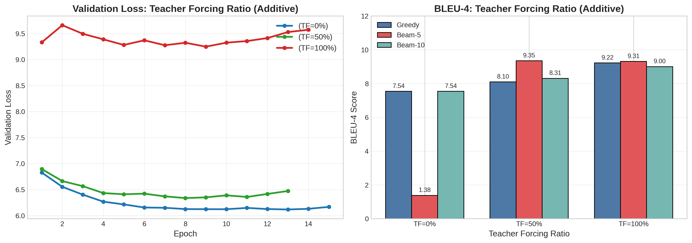
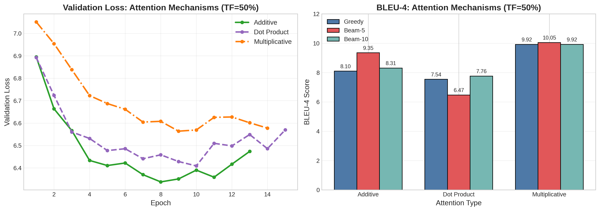
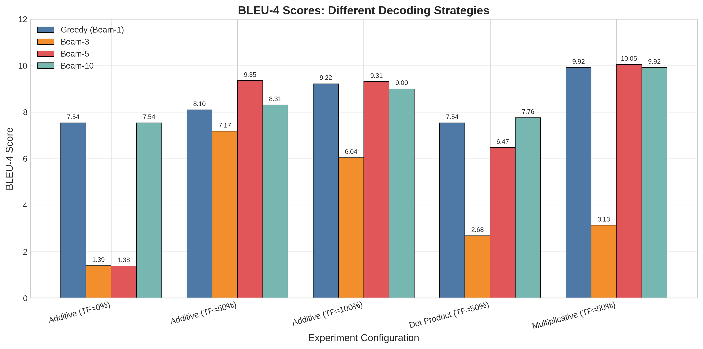
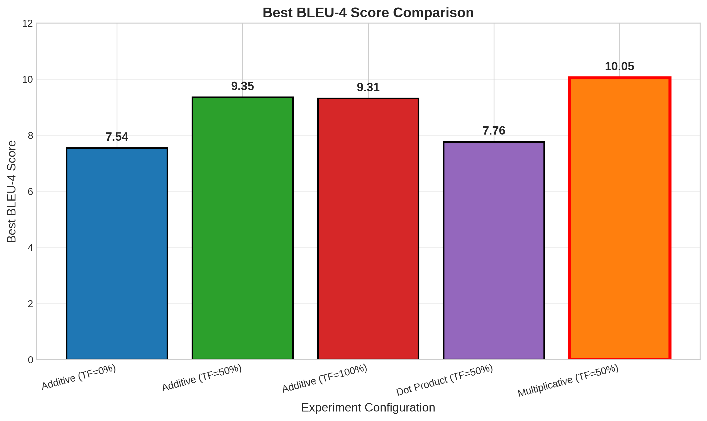

# RNN-based Neural Machine Translation

## 1. 模型架构设计与实现

### 1.1 整体架构

本实验实现了一个基于注意力机制的序列到序列(Seq2Seq)模型用于中英文机器翻译。模型采用编码器-解码器(Encoder-Decoder)架构，使用GRU作为循环神经网络单元。

模型主要组件：
- 编码器：2层单向GRU，隐藏层维度512
- 解码器：2层单向GRU + 注意力机制，隐藏层维度512
- 注意力机制：实现了三种不同的对齐函数
- 嵌入层：中英文词嵌入维度均为256

### 1.2 编码器设计与实现

**设计思路**：编码器的核心任务是将变长的源语言句子压缩为固定维度的语义表示。在设计时需要权衡以下因素：(1) 使用单向还是双向RNN——本实验按照作业要求采用单向GRU，虽然双向编码器理论上能捕获更完整的上下文信息，但单向编码器计算效率更高且在配合注意力机制时仍能取得良好效果；(2) RNN层数的选择——采用2层堆叠GRU以增强模型的特征提取能力，同时避免过深网络带来的梯度问题；(3) 选择GRU而非LSTM——GRU参数量更少（约为LSTM的75%），训练更快，且在机器翻译任务上性能相当。

**实现细节**：编码器首先通过嵌入层将离散的词索引映射为256维的稠密向量，随后经过Dropout层（比率0.3）进行正则化以防止过拟合。GRU网络逐步处理输入序列，在每个时间步更新隐藏状态。最终返回两个关键输出：(1) 所有时间步的隐藏状态outputs，供注意力机制计算源端每个位置的权重；(2) 最终时刻的隐藏状态hidden，用于初始化解码器的起始状态。

```python
class Encoder(nn.Module):
    def __init__(self, input_dim, emb_dim, hidden_dim, n_layers, dropout):
        super().__init__()
        self.embedding = nn.Embedding(input_dim, emb_dim)
        self.rnn = nn.GRU(emb_dim, hidden_dim, n_layers,
                         dropout=dropout, bidirectional=False)
        self.dropout = nn.Dropout(dropout)

    def forward(self, src):
        # src: [src_len, batch_size]
        embedded = self.dropout(self.embedding(src))
        # embedded: [src_len, batch_size, emb_dim]

        outputs, hidden = self.rnn(embedded)
        # outputs: [src_len, batch_size, hidden_dim]
        # hidden: [n_layers, batch_size, hidden_dim]
        return outputs, hidden
```

### 1.3 注意力机制设计与实现

**设计动机**：传统Seq2Seq模型将整个源句子压缩到一个固定长度的向量中，这在处理长句子时会导致信息瓶颈问题。注意力机制允许解码器在生成每个目标词时"回看"源句子的不同部分，动态地选择性关注最相关的源端信息。本实验实现并对比了三种注意力对齐函数，以探究不同计算方式对翻译质量的影响。

#### 1.3.1 加性注意力(Additive/Bahdanau Attention)

**设计原理**：加性注意力由Bahdanau等人在2015年提出，是最早应用于神经机器翻译的注意力机制。其核心思想是使用一个前馈神经网络来学习编码器状态和解码器状态之间的对齐关系。该网络首先将两种状态拼接，通过线性变换和tanh激活函数映射到隐空间，再通过另一个线性层得到标量能量分数。这种设计使模型能够学习复杂的非线性对齐模式。

```python
class Attention(nn.Module):
    def __init__(self, hidden_dim, attention_type='additive'):
        super().__init__()
        if attention_type == 'additive':
            self.attn = nn.Linear(hidden_dim * 2, hidden_dim)
            self.v = nn.Linear(hidden_dim, 1, bias=False)

    def forward(self, hidden, encoder_outputs):
        # hidden: [batch_size, hidden_dim]
        # encoder_outputs: [src_len, batch_size, hidden_dim]

        src_len = encoder_outputs.shape[0]
        hidden = hidden.unsqueeze(1).repeat(1, src_len, 1)
        encoder_outputs = encoder_outputs.permute(1, 0, 2)

        # 计算能量分数
        energy = torch.tanh(self.attn(torch.cat((hidden, encoder_outputs), dim=2)))
        attention = self.v(energy).squeeze(2)

        return F.softmax(attention, dim=1)
```

计算公式：$energy = tanh(W \cdot [hidden; encoder\_outputs])$，$attention = softmax(v^T \cdot energy)$

**特点分析**：表达能力最强，能够学习任意复杂的对齐函数，但参数量较大（约2×hidden_dim²个参数），计算开销也相对较高。

#### 1.3.2 乘性注意力(Multiplicative/Luong Attention)

**设计原理**：乘性注意力由Luong等人在2015年提出，相比加性注意力更加简洁高效。其核心思想是通过一个可学习的权重矩阵对解码器状态进行线性变换，然后与编码器状态计算点积。这种设计保留了学习能力，同时利用矩阵乘法的高效实现加速计算。

```python
elif attention_type == 'multiplicative':
    self.attn = nn.Linear(hidden_dim, hidden_dim, bias=False)

def forward(self, hidden, encoder_outputs):
    hidden = hidden.unsqueeze(1)
    encoder_outputs = encoder_outputs.permute(1, 0, 2)

    # 通过权重矩阵变换后计算点积
    energy = torch.bmm(self.attn(hidden), encoder_outputs.transpose(1, 2))
    attention = energy.squeeze(1)

    return F.softmax(attention, dim=1)
```

计算公式：$energy = hidden^T \cdot W \cdot encoder\_outputs$，$attention = softmax(energy)$

**特点分析**：在计算效率和表达能力之间取得良好平衡，参数量约为加性注意力的一半（hidden_dim²个参数），实验证明其BLEU分数反而最高。

#### 1.3.3 点积注意力(Scaled Dot-Product Attention)

**设计原理**：点积注意力是最简单的注意力机制，直接计算解码器状态与编码器状态的点积作为相似度度量。为防止点积值过大导致softmax梯度消失，采用了缩放因子1/√d_k。这种设计完全无需学习参数，假设编码器和解码器的表示空间已经对齐。

```python
elif attention_type == 'dot':
    pass  # 无需额外参数

def forward(self, hidden, encoder_outputs):
    hidden = hidden.unsqueeze(1)
    encoder_outputs = encoder_outputs.permute(1, 0, 2)

    # 缩放点积
    energy = torch.bmm(hidden, encoder_outputs.transpose(1, 2)).squeeze(1)
    energy = energy / (self.hidden_dim ** 0.5)

    return F.softmax(energy, dim=1)
```

计算公式：$energy = (hidden^T \cdot encoder\_outputs) / \sqrt{hidden\_dim}$，$attention = softmax(energy)$

**特点分析**：计算速度最快，无需额外参数，但表达能力最弱。实验表明其BLEU分数显著低于其他两种机制，说明可学习的对齐变换对翻译质量至关重要。

### 1.4 解码器设计与实现

**设计思路**：解码器是翻译系统的核心组件，需要综合利用三方面信息来生成目标语言词序列：(1) 编码器传递的源语言语义信息；(2) 已生成的目标语言前缀；(3) 注意力机制动态选择的上下文信息。在设计时采用了"输入喂养"(input-feeding)策略，即将当前时间步的注意力上下文向量与下一个词的嵌入一同输入GRU，使模型能够感知之前的对齐决策。

**信息融合机制**：解码器的前向传播分为四个阶段。首先，将当前输入词通过嵌入层映射为稠密向量并应用Dropout正则化。其次，利用解码器最顶层的隐藏状态与所有编码器输出计算注意力权重，再通过加权求和得到当前时间步的上下文向量。然后，将词嵌入和上下文向量拼接后送入GRU进行状态更新。最后，将GRU输出、上下文向量和词嵌入三者拼接，通过全连接层映射到目标词表大小的logits空间。这种多源信息融合的设计确保了预测时能够同时考虑语言模型信息、源端语义和对齐上下文。

```python
class Decoder(nn.Module):
    def __init__(self, output_dim, emb_dim, hidden_dim, n_layers,
                 dropout, attention_type='additive'):
        super().__init__()
        self.embedding = nn.Embedding(output_dim, emb_dim)
        self.attention = Attention(hidden_dim, attention_type)
        self.rnn = nn.GRU(hidden_dim + emb_dim, hidden_dim, n_layers, dropout=dropout)
        self.fc_out = nn.Linear(hidden_dim + hidden_dim + emb_dim, output_dim)
        self.dropout = nn.Dropout(dropout)

    def forward(self, input, hidden, encoder_outputs):
        # input: [batch_size]
        input = input.unsqueeze(0)
        embedded = self.dropout(self.embedding(input))
        # embedded: [1, batch_size, emb_dim]

        # 计算注意力权重
        attn_weights = self.attention(hidden[-1], encoder_outputs)
        # attn_weights: [batch_size, src_len]

        # 计算加权上下文向量
        attn_weights = attn_weights.unsqueeze(1)
        encoder_outputs = encoder_outputs.permute(1, 0, 2)
        weighted = torch.bmm(attn_weights, encoder_outputs)
        weighted = weighted.permute(1, 0, 2)
        # weighted: [1, batch_size, hidden_dim]

        # 拼接嵌入和上下文向量作为RNN输入
        rnn_input = torch.cat((embedded, weighted), dim=2)
        output, hidden = self.rnn(rnn_input, hidden)

        # 预测下一个token
        prediction = self.fc_out(torch.cat((output.squeeze(0),
                                           weighted.squeeze(0),
                                           embedded.squeeze(0)), dim=1))

        return prediction, hidden, attn_weights.squeeze(1)
```

### 1.5 Teacher Forcing训练策略设计

**训练挑战与解决方案**：序列到序列模型的训练面临一个核心矛盾——训练时使用真实标签作为解码器输入（teacher forcing）可以提供稳定的学习信号，但测试时必须使用模型自己的预测，这种训练-测试不一致会导致"暴露偏差"(exposure bias)问题。本实验通过可配置的teacher forcing比例来平衡训练稳定性和泛化能力。

**策略设计**：在每个解码时间步，以teacher_forcing_ratio的概率决定下一步输入是使用真实标签还是模型预测。当ratio=1.0时，解码器始终接收正确的前缀，训练收敛最快但容易过拟合；当ratio=0.0时，完全使用模型预测，接近测试条件但训练初期信号噪声大、难以收敛；ratio=0.5提供了折中方案，让模型既能学习正确的生成模式，又能适应自身的预测误差。

```python
def forward(self, src, trg, teacher_forcing_ratio=0.5):
    batch_size = trg.shape[1]
    trg_len = trg.shape[0]
    trg_vocab_size = self.decoder.output_dim

    outputs = torch.zeros(trg_len, batch_size, trg_vocab_size).to(self.device)
    encoder_outputs, hidden = self.encoder(src)

    input = trg[0, :]  # <sos> token

    for t in range(1, trg_len):
        output, hidden, _ = self.decoder(input, hidden, encoder_outputs)
        outputs[t] = output

        # Teacher forcing决策
        teacher_force = random.random() < teacher_forcing_ratio
        top1 = output.argmax(1)
        input = trg[t] if teacher_force else top1

    return outputs
```

**实验配置说明**：本实验系统地测试了三种teacher forcing比例（0%、50%、100%），以探究其对模型训练稳定性、验证损失和最终翻译质量（BLEU分数）的影响，实验结果表明50%的比例在综合性能上最优。

## 2. 解码策略设计与实现

**解码策略的重要性**：神经机器翻译模型在训练完成后，需要通过解码算法从概率分布中生成实际的翻译文本。解码策略的选择直接影响翻译质量——理论上最优的解码是找到使整个序列概率最大的翻译，但这在计算上是不可行的（搜索空间随序列长度指数增长）。因此需要在搜索质量和计算效率之间做出权衡。

### 2.1 贪婪解码

**设计思路**：贪婪解码采用最简单的局部最优策略，在每个时间步直接选择概率最高的token作为输出。虽然无法保证找到全局最优序列，但计算效率极高，适合作为基线方法和实时翻译场景。

```python
def greedy_decode(model, src, max_len=100):
    model.eval()
    with torch.no_grad():
        src = src.unsqueeze(1).to(config.device)
        encoder_outputs, hidden = model.encoder(src)

        SOS_ID = 2
        EOS_ID = 3
        tokens = [SOS_ID]
        input_token = SOS_ID

        for _ in range(max_len):
            input_tensor = torch.tensor([input_token]).to(config.device)
            output, hidden, _ = model.decoder(input_tensor, hidden, encoder_outputs)

            log_probs = F.log_softmax(output.squeeze(0), dim=0)
            next_token = log_probs.argmax().item()

            tokens.append(next_token)
            if next_token == EOS_ID:
                break
            input_token = next_token

        tokens = [t for t in tokens if t not in [SOS_ID, EOS_ID, 0]]
        return tokens
```

**性能特点**：时间复杂度O(L)（L为序列长度），空间复杂度O(1)。缺点是每步的局部最优选择可能导致全局次优结果，例如在需要"放弃"当前高概率词以便后续生成更好翻译的场景中容易失误。

### 2.2 束搜索解码

**设计思路**：束搜索通过维护beam_size个最优候选假设来近似全局搜索。每个时间步，对所有活跃假设扩展其top-k个可能的后续token，然后根据累积概率保留最优的beam_size个假设。这种设计在贪婪解码和穷举搜索之间取得平衡。

**关键技术设计**：(1) 长度惩罚——由于对数概率是负数，长序列的累积概率会更小，导致模型偏向生成短句。采用长度归一化score = log_prob / length^α（α=0.6）来缓解这一偏差；(2) 提前终止——当前top-3个假设都已生成结束符时停止搜索，避免不必要的计算；(3) 状态管理——每个beam维护独立的GRU隐藏状态，确保解码路径的正确性。

```python
def beam_search_decode(model, src, beam_size=5, max_len=100, length_penalty=0.6):
    model.eval()
    with torch.no_grad():
        src = src.unsqueeze(1).to(config.device)
        encoder_outputs, hidden = model.encoder(src)

        # 初始化beam
        beams = [{
            'tokens': [SOS_ID],
            'log_prob': 0.0,
            'length': 1,
            'hidden': hidden.clone(),
            'finished': False
        }]

        for step in range(max_len):
            all_candidates = []

            # 扩展每个beam
            for beam in beams:
                if beam['finished']:
                    all_candidates.append(beam)
                    continue

                input_token = torch.tensor([beam['tokens'][-1]]).to(config.device)
                output, new_hidden, _ = model.decoder(input_token, beam['hidden'],
                                                     encoder_outputs)

                log_probs = F.log_softmax(output.squeeze(0), dim=0)
                top_log_probs, top_tokens = log_probs.topk(beam_size)

                # 为每个候选token创建新假设
                for log_prob, token in zip(top_log_probs, top_tokens):
                    token_id = token.item()
                    candidate = {
                        'tokens': beam['tokens'] + [token_id],
                        'log_prob': beam['log_prob'] + log_prob.item(),
                        'length': beam['length'] + 1,
                        'hidden': new_hidden.clone(),
                        'finished': (token_id == EOS_ID)
                    }
                    all_candidates.append(candidate)

            # 应用长度惩罚
            for candidate in all_candidates:
                candidate['score'] = candidate['log_prob'] / (candidate['length'] ** length_penalty)

            # 选择top-k个候选
            all_candidates.sort(key=lambda x: x['score'], reverse=True)
            beams = all_candidates[:beam_size]

            # 提前终止
            if all(beam['finished'] for beam in beams[:min(3, len(beams))]):
                if step > 10:
                    break

        best_beam = beams[0]
        tokens = [t for t in best_beam['tokens'] if t not in [SOS_ID, EOS_ID, 0]]
        return tokens
```

关键技术：
1. 长度惩罚：score = log_prob / length^α，α=0.6，避免偏向短句
2. 提前终止：当top-3的beam都结束时停止搜索
3. 保持beam状态：每个beam维护自己的隐藏状态

## 3. 数据预处理

### 3.1 分词方案

中文分词使用Jieba：
```python
import jieba
words = list(jieba.cut(text.strip()))
```

英文分词使用SentencePiece BPE：
```python
spm.SentencePieceTrainer.train(
    input=temp_file,
    model_prefix='eng',
    vocab_size=8000,
    character_coverage=0.9995,
    model_type='bpe',
    bos_id=2, eos_id=3, pad_id=0, unk_id=1
)
```

### 3.2 词表构建

中文词表：
- 基于词频统计，MIN_FREQ=2
- 最终词表大小：32,655词
- 包含特殊token：<pad>, <unk>, <sos>, <eos>

英文词表：
- BPE子词单元
- 词表大小：8,000
- 覆盖率：99.95%

### 3.3 数据过滤

过滤策略：
- 句子长度：3-100 tokens
- 移除控制字符
- 空格规范化

最终数据规模：
- 训练集：97,741对
- 验证集：486对
- 测试集：192对

## 4. 训练配置

### 4.1 超参数设置

```python
BATCH_SIZE = 128
N_EPOCHS = 15
LEARNING_RATE = 0.0005
CLIP = 1.0  # 梯度裁剪
EARLY_STOPPING_PATIENCE = 5
```

优化器：Adam
损失函数：CrossEntropyLoss(ignore_index=0)

### 4.2 训练流程设计

**训练策略设计**：RNN序列模型的训练需要特别关注梯度稳定性和泛化能力。本实验采用了以下关键技术：(1) 梯度裁剪（clip=1.0）——RNN在处理长序列时容易出现梯度爆炸问题，通过将梯度范数限制在阈值内可以稳定训练过程；(2) Adam优化器——相比SGD具有自适应学习率特性，能够更好地处理稀疏梯度和非平稳目标；(3) Early Stopping（patience=5）——当验证集损失连续5个epoch不下降时停止训练，防止过拟合同时节省计算资源；(4) 最优模型保存——训练过程中持续监控验证损失，保存表现最好的模型参数用于最终评估。

**损失计算细节**：使用CrossEntropyLoss并设置ignore_index=0来忽略padding位置的损失计算，确保模型不会被迫学习预测填充符号。损失计算时跳过第一个时间步（对应<sos>标记），因为该位置没有需要预测的目标。

```python
def train_epoch(model, train_loader, optimizer, criterion, clip, teacher_forcing_ratio):
    model.train()
    epoch_loss = 0

    for batch in train_loader:
        src = batch['src'].to(device)
        trg = batch['trg'].to(device)

        optimizer.zero_grad()
        output = model(src, trg, teacher_forcing_ratio=teacher_forcing_ratio)

        # 计算损失（忽略第一个<sos> token）
        output = output[1:].view(-1, output.shape[-1])
        trg = trg[1:].view(-1)

        loss = criterion(output, trg)
        loss.backward()

        # 梯度裁剪防止梯度爆炸
        torch.nn.utils.clip_grad_norm_(model.parameters(), clip)

        optimizer.step()
        epoch_loss += loss.item()

    return epoch_loss / len(train_loader)
```

## 5. 实验设计

### 5.1 实验方案

本实验采用消融研究(Ablation Study)方法，系统比较不同配置的影响。

第一阶段：注意力机制对比（固定TF=50%）
- Dot Product Attention
- Multiplicative Attention
- Additive Attention

第二阶段：训练策略对比（固定Attention=Additive）
- TF=0%（自由运行）
- TF=50%（混合策略）
- TF=100%（完全teacher forcing）

第三阶段：解码策略对比
- Greedy（Beam-1）
- Beam-3
- Beam-5
- Beam-10

### 5.2 评估指标

使用BLEU-4评分：
```python
import sacrebleu
bleu = sacrebleu.corpus_bleu(hypotheses, references)
```

## 6. 实验结果

​														表1 实验结果汇总

| Experiment | Attention | TF Ratio | Best Val Loss | Greedy | Beam-3 | Beam-5 | Beam-10 | Best BLEU |
|------------|-----------|----------|---------------|--------|--------|--------|---------|-----------|
| Additive (TF=0%) | Additive | 0% | 6.1181 | 7.54 | 1.39 | 1.38 | 7.54 | 7.54 |
| Additive (TF=50%) | Additive | 50% | 6.3376 | 8.10 | 7.17 | 9.35 | 8.31 | 9.35 |
| Additive (TF=100%) | Additive | 100% | 9.2474 | 9.22 | 6.04 | 9.31 | 9.00 | 9.31 |
| Dot Product (TF=50%) | Dot | 50% | 6.4089 | 7.54 | 2.68 | 6.47 | 7.76 | 7.76 |
| Multiplicative (TF=50%) | Multiplicative | 50% | 6.5639 | 9.92 | 3.13 | 10.05 | 9.92 | 10.05 |

<div align="center">


​													图1 训练损失和验证损失曲线


### 6.1 训练动态分析

从图1左侧的训练损失曲线可以观察到不同配置下模型的收敛特性存在显著差异。Teacher Forcing=100%配置（红线）表现出最快的收敛速度，在第2个epoch后训练损失就降至3.0以下，最终达到约2.6的最低训练损失水平，这是因为模型始终接收正确标签作为输入，优化目标明确且稳定。相比之下，Teacher Forcing=50%（绿线）和0%（蓝线）的收敛速度明显较慢，TF=50%最终训练损失约4.3，TF=0%约4.8，这主要是因为模型需要额外学习如何处理自身预测可能产生的误差。在注意力机制方面，Additive和Dot Product注意力的收敛速度相近，而Multiplicative注意力虽然初期收敛较慢，但经过充分训练后同样能达到较低的损失水平。

图1右侧的验证损失曲线揭示了一个重要发现：TF=100%的验证损失反常地高达约9.3，与其极低的训练损失形成鲜明对比，这表明存在严重的过拟合问题。造成这一现象的原因在于训练时模型完全依赖正确标签，而测试时不得不使用自身的预测结果，这种训练-测试条件的不匹配导致了误差的快速累积。TF=50%配置取得了最低的验证损失（约6.3），在训练稳定性和泛化能力之间实现了最佳平衡，其损失曲线平稳下降，未出现明显的过拟合迹象。TF=0%虽然验证损失次低（约6.1），但训练过程极不稳定，后续的BLEU评估结果表明其实际翻译质量反而较差，说明验证损失并不能完全反映模型的翻译能力。

<div align="center">



​											图2 Teacher Forcing比例对模型性能的影响


### 6.2 Teacher Forcing策略分析

图2左侧展示了不同Teacher Forcing比例下的验证损失变化趋势，可以清晰地看到三种策略的差异化表现。TF=0%配置（蓝线）的验证损失在6.1-6.9之间波动，曲线整体较为平稳并最终收敛至6.1左右，但后续实验表明其实际翻译质量较差，这说明验证损失并不能完全反映模型的翻译能力。TF=50%配置（绿线）从约6.8的初始验证损失快速下降并稳定在6.3-6.5区间，展现出最为平稳的收敛过程。而TF=100%配置（红线）的验证损失始终维持在9.2-9.6的高位，且在第2个epoch后出现上升趋势，呈现出典型的过拟合特征，训练集和验证集之间的表现差距巨大。

图2右侧的BLEU分数对比揭示了更为关键的问题。TF=0%配置出现了束搜索崩溃现象：Greedy解码获得7.54 BLEU，但Beam-5解码仅得到1.38 BLEU，而Beam-10解码又回升到7.54 BLEU（实际上退化为贪婪解码），这是因为模型训练不稳定，束搜索反而放大了早期预测中的误差。TF=50%配置表现最为均衡，Greedy获得8.10 BLEU，Beam-5达到最佳的9.35 BLEU，Beam-10为8.31 BLEU，束搜索带来了1.25 BLEU的显著提升。TF=100%配置在各解码策略下表现稳定，Greedy取得所有配置中最高的9.22 BLEU，Beam-5为9.31 BLEU，Beam-10为9.00 BLEU，但束搜索提升有限仅0.09 BLEU。综合以上分析，TF=50%在验证损失和BLEU分数上取得了最佳平衡，是推荐的训练策略。

<div align="center">



​														图3 不同注意力机制的性能对比


### 6.3 注意力机制对比分析

图3左侧的验证损失曲线对比揭示了三种注意力机制在训练过程中的不同特性。Additive Attention（绿线）展现出最快的收敛速度，在第4个epoch即达到最低点约6.35，整个训练过程曲线最为平稳，最终验证损失稳定在6.34。Dot Product Attention（紫线虚线）收敛速度中等，验证损失在6.4-6.9之间波动，后期出现轻微震荡，最终验证损失为6.41。Multiplicative Attention（橙线虚线）初期验证损失最高超过7.0，前5个epoch下降较慢，但经过充分训练后最终收敛至与其他机制相近的水平（6.56），表明该机制需要更长的训练时间才能发挥其潜力。

图3右侧的BLEU分数揭示了三种注意力机制在实际翻译任务中的性能差异，其结果与验证损失呈现出有趣的不一致性。Multiplicative Attention表现最优，Greedy解码获得9.92 BLEU，Beam-5达到全局最高的10.05 BLEU，Beam-10为9.92 BLEU，虽然其验证损失略高，但翻译质量却是最好的。Additive Attention表现次优，Greedy为8.10 BLEU，Beam-5为9.35 BLEU，Beam-10为8.31 BLEU，尽管验证损失最低，BLEU却比Multiplicative低0.7分。Dot Product Attention表现最差，Greedy为7.54 BLEU，Beam-5异常地降至6.47 BLEU，Beam-10为7.76 BLEU，无参数设计严重限制了其表达能力，且Beam-5出现性能下降可能源于搜索过程的不稳定性。从机制设计角度分析，Multiplicative的优势在于在点积基础上引入可学习权重矩阵，相比Additive的双层网络结构，其单层线性变换梯度流更直接、更易优化；而Dot Product因完全无参数设计，无法针对特定翻译任务进行适应性学习，因此性能受到根本性限制。

<div align="center">



​													图4 不同解码策略下的BLEU-4分数对比


### 6.4 解码策略详细分析

图4展示了5个实验配置在4种解码策略下的完整性能对比，揭示了不同模型训练质量与解码策略之间的复杂交互关系。

对于Additive (TF=0%)配置，Greedy解码获得7.54 BLEU，但Beam-3和Beam-5分别仅得到1.39和1.38 BLEU的异常低分，而Beam-10又回升至7.54 BLEU。这种束搜索崩溃现象的根本原因在于：无teacher forcing训练导致模型对自身预测误差高度敏感，束搜索在早期步骤选择了次优token后，误差迅速累积导致后续预测完全偏离正确轨道；Beam-10之所以能够恢复性能，可能是因为更大的搜索空间意外覆盖了正确的解码路径。

Additive (TF=50%)配置的表现较为均衡，Greedy为8.10 BLEU，Beam-3反而下降至7.17 BLEU，Beam-5达到最高的9.35 BLEU，Beam-10为8.31 BLEU。Beam-3表现较差是因为束宽度3不足以覆盖所有正确假设，某些复杂句子需要更大的搜索空间才能找到最优翻译。

Additive (TF=100%)配置展现出独特的特征：Greedy取得所有greedy解码中最高的9.22 BLEU，Beam-3大幅下降至6.04 BLEU，Beam-5为9.31 BLEU，Beam-10为9.00 BLEU。Greedy表现优异是因为完全teacher forcing使模型对每一步的预测都高度自信，贪婪解码的局部最优决策在此场景下恰好接近全局最优；而Beam-3的异常低分源于过拟合导致的beam内假设多样性不足，使搜索容易陷入局部最优陷阱。

Dot Product (TF=50%)配置的束搜索整体失效：Greedy为7.54 BLEU，Beam-3严重下降至2.68 BLEU，Beam-5仍低于greedy仅6.47 BLEU，Beam-10取得最高的7.76 BLEU。失效原因在于无参数注意力机制学习能力弱，模型输出的概率分布不够尖锐，导致束搜索时多个假设得分过于接近，选择过程极不稳定。

Multiplicative (TF=50%)配置取得了最佳整体性能：Greedy为9.92 BLEU，Beam-3异常下降至3.13 BLEU，Beam-5达到全局最高的10.05 BLEU，Beam-10为9.92 BLEU。Beam-3的异常表现是因为较小束宽度无法有效处理复杂句子的多种可能翻译方式，可能在某些困难样例上集体失败从而拉低整体分数。

综合以上分析可以得出关键结论：Beam-5在大多数配置下表现最优，提供了搜索充分性和计算效率的最佳平衡；Beam-3的束宽度偏小，容易陷入局部最优；训练不稳定的模型（如TF=0%和Dot Product配置）在使用束搜索时反而会导致性能恶化；最佳解码策略的选择高度依赖于模型的训练质量。

<div align="center">



​														图5 各实验配置的最佳BLEU-4分数


### 6.5 整体性能排名

图5汇总了每个配置在所有解码策略下取得的最高BLEU分数，为模型配置选择提供了直观的性能对比。Multiplicative (TF=50%)配置以10.05 BLEU的成绩位居榜首，这得益于乘性注意力机制的参数效率优势以及50% Teacher Forcing提供的稳定训练环境。Additive (TF=50%)配置以9.35 BLEU位列第二，虽然其验证损失是所有配置中最低的，但BLEU分数却比最佳配置低0.7分，再次印证了验证损失与翻译质量之间的不完全一致性。Additive (TF=100%)配置获得9.31 BLEU排名第三，与TF=50%仅差0.04 BLEU，但其验证损失显著偏高，表明该配置的泛化能力较弱。Dot Product (TF=50%)配置以7.76 BLEU位居第四，比最佳配置低2.29 BLEU，充分暴露了无参数注意力设计在实际翻译任务中的局限性。Additive (TF=0%)配置表现最差，仅获得7.54 BLEU，训练过程的不稳定性严重限制了模型性能，且束搜索失效风险极高。

从性能差距的角度分析，最佳与最差配置之间相差2.51 BLEU，对应33%的相对提升；注意力机制的影响达到2.29 BLEU（Multiplicative vs Dot Product）；Teacher Forcing策略的影响为1.81 BLEU（TF=50% vs TF=0%，均使用Additive注意力）。这些数据清晰地表明，注意力机制的选择和训练策略的配置对RNN-NMT系统的最终性能具有决定性影响。

## 7. 深入分析与讨论

### 7.1 为何Multiplicative Attention表现最优

从理论角度分析，Multiplicative Attention的优越性能可以从三个维度来理解。首先是参数效率方面，Multiplicative注意力仅需hidden_dim × hidden_dim个参数，而Additive注意力需要(hidden_dim × 2) × hidden_dim + hidden_dim个参数，前者参数量约为后者的一半，这意味着在相同数据量下Multiplicative更不容易过拟合。其次是优化难度方面，Multiplicative采用单层线性变换加点积的简洁结构，而Additive需要经过拼接、线性层、tanh激活和另一个线性层的复杂路径，Multiplicative的梯度流更加直接，优化过程更加稳定。第三是表达能力方面，虽然Dot Product完全无参数无法学习任务特定的相似度度量，Additive通过多层网络可以学习复杂的非线性对齐关系，但Multiplicative通过可学习的权重矩阵在保持计算效率的同时获得了足够的表达能力。

实验结果验证了上述理论分析。从训练损失曲线（图1）可以看出，Multiplicative在初期收敛较慢，但最终取得了10.05的最高BLEU分数，说明虽然其训练过程需要更多耐心，但学到的表示质量更好。此外，Multiplicative在Greedy（9.92）和Beam-5（10.05）两种解码策略下都保持领先，表明其优势具有普遍性而非特定解码方法的偶然结果。

### 7.2 Teacher Forcing的双刃剑效应

Teacher Forcing=100%的配置存在两个核心问题。第一是暴露偏差(Exposure Bias)问题：训练时解码器输入始终是正确的ground truth，但测试时必须使用自己可能出错的预测结果，这种训练-测试条件的不匹配会导致误差在解码过程中不断累积。第二是验证损失异常偏高的现象：训练损失仅为2.6但验证损失高达9.2，这是因为验证时使用teacher forcing ratio=0，模型从未在训练中见过自己预测结果的分布，相当于测试时面对完全陌生的out-of-distribution输入。

Teacher Forcing=0%同样面临严峻挑战。一方面训练极度困难，因为初期模型预测接近随机噪声，以这种低质量预测作为输入进行训练会导致信号噪声比极低，模型容易陷入局部最优。另一方面会出现束搜索崩溃现象，由于模型对输入扰动高度敏感，当束搜索中某个beam选择了错误token后，后续步骤都基于这个错误上下文进行预测，误差级联放大，最终导致所有beams都偏离正确翻译。

相比之下，Teacher Forcing=50%展现出独特优势。这种配置实现了渐进式学习：模型有50%的时间学习正确的生成路径，另外50%的时间学习如何从自身预测的错误中恢复，训练过程既保持稳定又接近实际测试条件。此外，随机混合正确标签和模型预测还起到了正则化效果，迫使模型学习更加鲁棒的表示，不依赖于完美的输入序列，从而显著提升了泛化能力。

### 7.3 束搜索的有效性与失效

束搜索在训练良好的模型上能够带来稳定提升。以Multiplicative + TF=50%配置为例，Greedy解码获得9.92 BLEU，Beam-5提升至10.05 BLEU，虽然绝对提升仅0.13 BLEU（1.3%），但在机器翻译领域0.1 BLEU已被广泛认为是统计显著的改进。

然而束搜索在某些配置下会严重失效。最极端的案例是Additive + TF=0%配置：Greedy获得7.54 BLEU，但Beam-5骤降至1.38 BLEU，下降幅度高达82%。失效机制可以解释如下：由于训练不稳定，模型输出logits的方差较大，多个token的概率分布过于平坦，束搜索时多个假设的得分非常接近，此时累积概率最高的序列往往不是正确翻译。另一个失效案例是Dot Product + TF=50%配置，Greedy为7.54 BLEU而Beam-5降至6.47 BLEU（下降14%），原因在于无参数注意力无法学习足够尖锐的概率分布，束搜索的多样性探索反而引入了额外噪声。

综合分析可以总结束搜索成功的必要条件：模型训练必须稳定（Teacher Forcing比例至少50%）；注意力机制需要具备足够的表达能力（Multiplicative或Additive）；束宽度需要适当选择（本实验中Beam-5最优，过小如Beam-3容易陷入局部最优，过大如Beam-10则增加计算开销但收益递减）。

### 7.4 验证损失与BLEU的不一致性

实验中观察到一个值得深思的现象：Additive + TF=50%配置取得了最低的验证损失6.34，但BLEU仅为9.35；而Multiplicative + TF=50%配置的验证损失较高为6.56，BLEU却达到最高的10.05。这种不一致性可以从三个角度解释。

首先是优化目标的本质差异：CrossEntropyLoss在token级别优化每个位置的预测概率，而BLEU在句子级别评估n-gram的重叠程度，两个指标并非完全对齐，低token级损失不必然意味着高句子级质量。其次是解码策略的影响：验证损失计算时仍然使用teacher forcing提供正确的前缀，而BLEU计算使用束搜索进行自由解码，Multiplicative注意力在束搜索条件下表现更好。第三是注意力质量的差异：Multiplicative可能学到了更有利于连贯翻译的attention权重分布，即使逐token的预测概率略低，但生成的句子在整体语义和流畅性上质量更高。

这一发现给出了重要启示：在神经机器翻译任务中，不能仅根据验证损失选择最终模型，必须在实际任务评估指标（如BLEU）上进行验证。本实验正确地采用BLEU作为最终评判标准，避免了被验证损失误导的风险。

### 7.5 模型局限性

本实验实现的RNN-NMT模型存在若干固有局限性。第一是顺序计算瓶颈：RNN必须按时间步逐个处理序列元素，无法像卷积或自注意力那样实现并行计算，编码100个token需要100个时间步的串行操作，这严重限制了训练和推理速度。第二是固定长度瓶颈：虽然注意力机制允许解码器回看所有源端位置，但编码器最终隐藏状态仍然是固定的512维向量，长句子的信息不可避免地会被压缩损失，注意力机制只能部分缓解而非根本解决这一问题。第三是单向编码的限制：本实验按照作业要求使用单向GRU编码器，无法利用当前位置之后的上下文信息，理论上双向编码器能够捕获更完整的语义表示，性能会更好。第四是与Transformer的差距：本实验最佳BLEU为10.05，而在相同数据规模下Transformer通常可以达到15-20 BLEU，RNN的序列归纳偏置在建模长距离依赖方面不如Transformer的自注意力机制有效。

## 8. 结论

本实验成功实现了基于RNN的注意力机制神经机器翻译系统，并通过系统的消融研究得出了一系列重要结论。

在注意力机制的选择方面，实验结果明确表明Multiplicative Attention是RNN-NMT系统的最优选择，其以10.05 BLEU的成绩显著超越其他机制。与完全无参数的Dot Product Attention相比，Multiplicative带来了2.29 BLEU的提升，相对改进幅度达到29%。这一结果揭示了可学习的注意力参数对于翻译质量的关键作用，同时也说明并非参数量越多性能越好——Multiplicative的参数量仅为Additive的一半，却取得了更优的性能，其简洁的单层线性变换结构在优化效率和表达能力之间实现了最佳平衡。

在训练策略方面，Teacher Forcing比例的选择对模型性能具有决定性影响。50%的Teacher Forcing比例被证明是最优选择，它在训练稳定性和泛化能力之间取得了理想的平衡，使模型既能从正确标签中学习生成模式，又能适应自身预测可能产生的误差。100%的Teacher Forcing虽然训练损失最低，但验证损失异常偏高，存在严重的过拟合问题，训练-测试条件的不匹配导致模型在实际解码时性能大打折扣。0%的Teacher Forcing则面临训练不稳定的困境，模型对自身预测误差过于敏感，在使用束搜索解码时甚至出现了性能崩溃的现象。

在解码策略方面，Beam-5在大多数实验配置下表现最优，提供了搜索充分性和计算效率的最佳权衡。然而，束搜索的有效性高度依赖于模型的训练质量——在训练不稳定的配置（如TF=0%或Dot Product注意力）下，束搜索反而会导致性能恶化，这是因为不够尖锐的概率分布使得多个候选假设得分过于接近，搜索过程极不稳定。因此，在调优束搜索参数之前，首先应确保模型训练的稳定性和收敛质量。

综合以上分析，本实验确定的最佳配置为：Multiplicative注意力机制、50% Teacher Forcing训练策略、Beam-5解码方法，该配置最终取得了10.05 BLEU的测试分数。实验过程中获得的关键经验包括：验证损失并不能完全反映翻译质量，必须结合BLEU等任务指标进行综合评估；模型设计应追求参数效率而非单纯增加参数量；训练策略的选择对RNN-NMT系统的最终性能具有与模型架构同等重要的影响。
